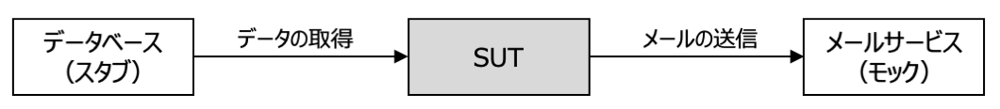

# テストの考え方と実装方法 in Python

[単体テストの考え方／使い方](https://book.mynavi.jp/ec/products/detail/id=134252)


本文書では、**古典学派 (デトロイト学派) の解釈を採用**しています。

- [テストの考え方と実装方法 in Python](#テストの考え方と実装方法-in-python)
  - [テストの種類](#テストの種類)
    - [単体テスト (Unit Test) の概要](#単体テスト-unit-test-の概要)
    - [統合テスト (Integration Test) の概要](#統合テスト-integration-test-の概要)
    - [E2E (End to End Test) の概要](#e2e-end-to-end-test-の概要)
  - [テストを実装する理由](#テストを実装する理由)
  - [共有依存 (shared dependency)](#共有依存-shared-dependency)
  - [プライベート依存 (private dependency)](#プライベート依存-private-dependency)
    - [プライベートな不変依存](#プライベートな不変依存)
      - [値オブジェクト (value object)](#値オブジェクト-value-object)
    - [プライベートな可変依存](#プライベートな可変依存)
  - [プロセス外依存](#プロセス外依存)
    - [管理下にある依存 (managed dependency)](#管理下にある依存-managed-dependency)
    - [管理下にない依存 (unmanaged dependency)](#管理下にない依存-unmanaged-dependency)
  - [テストの品質の維持](#テストの品質の維持)
  - [網羅率](#網羅率)
    - [コード網羅率 (code coverage)](#コード網羅率-code-coverage)
    - [分岐網羅率 (branch coverage)](#分岐網羅率-branch-coverage)
    - [網羅率をテストスイートの品質としてはいけない理由](#網羅率をテストスイートの品質としてはいけない理由)
  - [品質の良いテストスイートの条件](#品質の良いテストスイートの条件)
    - [テストすることが開発サイクルの中に組み込まれている](#テストすることが開発サイクルの中に組み込まれている)
    - [コードベースの特に重要な部分のみがテスト対象になっている](#コードベースの特に重要な部分のみがテスト対象になっている)
    - [最小限の保守コストで最大限の価値を生み出すようになっている](#最小限の保守コストで最大限の価値を生み出すようになっている)
  - [単体テスト](#単体テスト)
    - [単体テストに求められる要件](#単体テストに求められる要件)
    - [単体テストの構造](#単体テストの構造)
      - [1つのフェースが複数存在する場合](#1つのフェースが複数存在する場合)
      - [分岐がある場合](#分岐がある場合)
      - [実行フェーズが1行以上になる場合](#実行フェーズが1行以上になる場合)
      - [テスト後の後始末](#テスト後の後始末)
      - [テスト対象システムの変数名](#テスト対象システムの変数名)
      - [テスト対象の振る舞いの中に分岐がある場合](#テスト対象の振る舞いの中に分岐がある場合)
      - [単体テストの名前](#単体テストの名前)
    - [単体テストの要件](#単体テストの要件)
      - [単体テストの4つの柱](#単体テストの4つの柱)
        - [退行 (regression) に対する保護](#退行-regression-に対する保護)
        - [リファクタリングへの耐性](#リファクタリングへの耐性)
        - [迅速なフィードバック](#迅速なフィードバック)
        - [保守のしやすさ](#保守のしやすさ)
      - [理想的な単体テスト](#理想的な単体テスト)
      - [取るに足らないテスト](#取るに足らないテスト)
    - [ブラックボックステスト](#ブラックボックステスト)
  - [モック](#モック)
    - [テストダブルの種類](#テストダブルの種類)
      - [モック](#モック-1)
      - [スタブ](#スタブ)
    - [コマンド・クエリ分離の原則 (CQS: Command Query Separation)とモックとスタブ](#コマンドクエリ分離の原則-cqs-command-query-separationとモックとスタブ)
  - [リファクタリング](#リファクタリング)
    - [リファクタリングが必要なコードの識別](#リファクタリングが必要なコードの識別)
      - [ドメインモデル／アルゴリズム](#ドメインモデルアルゴリズム)
      - [取るに足らないコード](#取るに足らないコード)
      - [コントローラー](#コントローラー)
      - [過度に複雑なコード](#過度に複雑なコード)

## テストの種類

- 単体テスト (Unit Test)
- 統合テスト (Integration Test)
- E2Eテスト (End to End Test)


### 単体テスト (Unit Test) の概要

- **テストの実行が自動化**されていること
- **1単位の振る舞い (a unit of behavior)** を検証すること
- **実行時間が短い**こと
- **他のテストケースから隔離**して実行できること

単体テストでは、関数やクラスのメソッドなど、**1つの振る舞い**を検証します。

また、実行時間を短くすることで、**繰り返し単体テストを実行**できるように開発者の負担を軽減します。
実行時間が長くなると、開発者がテストを実行する回数が減り、バグを見つけるまでの時間が長くなります。
バグが見つかるまでの時間が長くなると、それまでにコードベースは大きくなるため、バグの特定と修正に時間がかかるようになります。

さらに、それぞれの単体テストが他の単体テストと独立することで、他の単体テストからの影響を受けず、個別に実行できるようになります。
これに、単体テストを**個別に実行**したり、同時に**複数の単体テストを並行／並列で実行**することができます。

### 統合テスト (Integration Test) の概要

`統合テスト`は、システム全体が意図したように機能することを検証するテストです。
システムの`ユースケース`ごとに、統合テストを実装して、それぞれまたは連続して実行します。

### E2E (End to End Test) の概要

`E2Eテスト`は、統合テストの上位に位置するテストです。
統合テストでは、システムが依存するメール送信サービスなどの外部サービスをテストダブルに置き換えますが、`E2Eテスト`では、ほぼすべての依存を実際のサービスを使用してテストします。

本文書では、`E2Eテスト`は説明の対象外とします。

## テストを実装する理由

テストを実装する理由は、システムが**将来も持続的に成長できるようにするため**です。
テストが実装されているシステムのことを`テスト対象システム (SUT: System Under Test)`と呼びます。

ほとんどのシステムは、リリース後に何度も仕様変更や改修が行われ、その中で`リファクタリング`されます。
テストが実装されているシステムの仕様変更や改修は、単体／統合テストを実行することで、変更がシステム全体に影響を与えないことを確認できます。
変更によりシステムに不具合が発生することを`退行 (regression)`と呼びますが、SUTは、退行を防ぐことができ、仕様変更や改修に対する開発者の負担を軽減します。

逆に、SUTでないシステムの変更は、変更がシステムに影響を与えたかを確認する工数が多くなり、開発者の負担が大きくなります。
この負担は、開発者のモチベーションを下げ、システムを変更しない理由となり、システムの成長を妨げるようになります。

システムのコードベースは、リリース後に成長しはじめ、劣化する傾向があるため、エントロピー（無秩序の量）が増大するため、リファクタリングが必要になります。
SUTは、退行を生み出す可能性が低くなり、リファクタリングに対する開発者の心理的不安をなくすことができます。

逆に、一時的に作成するプログラムなど、成長することがないシステムに対しては、簡易的なテストの実装で済ましたり、テストの実装を省くことができると考えられます。


## 共有依存 (shared dependency)

`共有依存 (shared dependency)`とはテストケースで共有される依存のことで、データベースなどがあります。
共有依存を扱うテストケースを同時に実行すると、お互いがテストに影響を与えるため、正常にテストが実行されなくなる場合があります。

単体テストにおいて、共有依存はテストダブルに置き換えられます。

## プライベート依存 (private dependency)

`プライベート依存 (private dependency)`とは、テストケースで共有されない依存で、`可変依存`と`不変依存`があります。

単体テストにおいて、プライベート依存は、1つのテスト対象オブジェクトからしか参照されないため、テストダブルに置き換えず、そのまま使用します。

### プライベートな不変依存

データが不変で、1つのテスト対象オブジェクトからしか使用されない場合、`プライベートな不変依存`となります。
プライベートな不変依存には、`値オブジェクト (value object)`などがあります。

#### 値オブジェクト (value object)

`ドメイン駆動設計 (Domain Driven Design: DDD`における値オブジェクトは、次の特徴を持ちます。

- 不変 (immutable: イミュータブル)
- 同一性を持たない (IDや識別子を持たない)
  - 同じ属性を持つ値オブジェクトは等価である
- 小さい属性の集合

`value_objects`モジュール、住所を表現する値オブジェクトをクラスで、色を表現する値オブジェクト列挙型で示します。

### プライベートな可変依存

データが可変で、1つのテスト対象オブジェクトからしか参照されない場合、`プライベートな可変依存`となります。
プライベートな可変依存には、ファイルシステムに作成された、1つのテスト対象オブジェクトからしか参照されないファイルなどがあります。

## プロセス外依存

システムは、データベースやメール配信サービスなど、システムが動作するプロセス以外で動作する依存があります。
この`プロセス外依存`は、次の2つに区分されます。

- 管理下にある依存 (managed dependency)
- 管理下にない依存 (unmanaged dependency)

### 管理下にある依存 (managed dependency)

`管理下にある依存`は、SUTしかアクセスしないデータベースなど、SUTが自由に操作でき、その振る舞いを確認できる依存を示します。

単体テストでは、管理下にある依存をテストダブルで置き換え、テストの実行時間を短くします。
一方、統合テストでは、管理下にある依存を実際に利用したテストを実装します。

### 管理下にない依存 (unmanaged dependency)

`管理下にない依存`は、外部サービスなど、費用や過度に負荷を与えることができないなどの理由でSUTが自由に操作できない依存を示します。
管理下にない依存は、単体テスト及び統合テストでテストダブルに置き換えます。

## テストの品質の維持

テストの品質が悪いとは次の状態を指します。

- エラーが発生してテストを実行できない
- 偽陽性 (False Positive) が発生する
  - プロダクションコードが正しいにも関わらず、テストに失敗する
- 偽陰性 (False Negative) が発生する
  - プロダクションコードが誤っているにも関わらず、テストに成功する

テストの品質が悪いとテストが信頼されなくなり、テストが実行されません。
その結果、システムの持続的な成長が阻害されます。

よって、テストの品質を保つために次を心がける必要があります。

- プロダクションコードのリファクタリングに合わせて、テストをリファクタリングする。
- プロダクションコードを変更するたびにテストを実行する。
- テストが偽陽性や偽陰性を発生した場合は、修正する。

プロダクションコードがどのように振る舞うか理解するために、テストコードのリーディングは非常に有益です。
よって、プロダクションコードだけでなくテストコードも適切に保守する必要があります。

## 網羅率

テストスイート（テスト全体）の品質を評価する指標として`網羅率`があります。
網羅率からは、**テストスイートの品質が悪いことを確認できますが、良いことを確認できない**ことに注意してください。

網羅率には次の2つがあります。

- `コード網羅率 (code coverage)`
- `分岐網羅率 (branch coverage)`

### コード網羅率 (code coverage)

`コード網羅率`は、テストスイートがプロダクションコードの行をどれだけ実行したかで計算されます。

$コード網羅率 = \frac{テストスイートが実行した行数}{プロダクションコードの行数}$

次の`is_string_long`関数のコード網羅率を考えます。

```python
def is_string_long(s: str) -> bool:   # 1
    if len(s) > 5:                    # 2
        return True                   # 3
    return False                      # 4

import unittest
class TestIsStringLong(unittest.TestCase):
    def test_is_string_long(self):
        result = is_string_long("abc")
        self.assertFalse(result)
```

上記の場合、`len(s)`は`3`であるため、1, 3, 4行目が実行され、コード網羅率は0.75 (3 / 4)になります。

しかし、`is_string_long`関数を次に変更したとき、コード網羅率は1.0になります。
プロダクションコードのリファクタリングによりテストの品質は向上していませんが、コード網羅率は0.75から1.0に向上しました。

```python
def is_string_long(s: str) -> bool:
    return True if len(s) > 5 else False
```

**コード網羅率はプロダクションコードの実装方法で結果が変わる**ため、コード網羅率だけでテストスイートの品質を判断することはできません。

### 分岐網羅率 (branch coverage)

`分岐網羅率`は、テストスイートがプロダクションコードに存在する分岐した経路を、どれだけ実行したかで計算されます。

$分岐網羅率 = \frac{テストスイートが実行した分岐数}{プロダクションコードの分岐数}$

リファクタリング前後の`is_string_long`関数の分岐網羅率はどちらも0.5です。

ここで、次のような関数の結果を評価しない**邪悪な**`確認不在のテスト`を実装すると、分岐網羅率は1.0になります。

```python
class TestIsStringLong(unittest.TestCase):
    def test_is_string_short(self):
        result = is_string_long("abc")

    def test_is_string_long(self):
        result = is_string_long("abcdef")
```

上記のテストは、`is_string_long`関数の分岐をすべて実行していますが、関数の結果である`result`を評価していません。

### 網羅率をテストスイートの品質としてはいけない理由

網羅率をテストスイートの品質としてはいけない理由は次の通りです。

- プロダクションコードの実装方法によってコード網羅率が変わる
- 分岐網羅率を増やすために、確認不在のテストが実装される

**網羅率でテストスイートの品質が悪いことを評価できます**。
しかし、逆に**網羅率はテストスイートの品質が良いことを評価できません**。

コード網羅率または分岐網羅率が0.6などの場合、テストされていないプロダクションコードが多く残っていることを示し、これはテストスイートの品質が悪いことを示します。

基本的に網羅率を高く維持されていれば、**テストされている**とみなせます。
しかし、網羅率を例えば85%以上に維持するなど、数値目標を設定することは、開発者に**人工的な目標**を設定することになり、テストスイートの品質を向上させることに繋がりません。

## 品質の良いテストスイートの条件

- テストすることが開発サイクルの中に組み込まれている
- コードベースの特に重要な部分のみがテスト対象になっている
- 最小限の保守コストで最大限の価値を生み出している

### テストすることが開発サイクルの中に組み込まれている

テストは常に実行されなければならず、テストの実行が開発サイクルの中に組み込まれていなくてはなりません。
理想的には、仮に変更が些細なことであっても、コードに変更を加えるたびにテストが実施されるようになっていることです。
テストは実行されて、初めて価値を持ちます。

リモートリポジトリの`develop`または`main`ブランチにプッシュされるたびに、CI/CDパイプラインが実行されるように設定することが望ましいです。

### コードベースの特に重要な部分のみがテスト対象になっている

ほとんどのシステムにおいて、システムの核はビジネスロジックを含むコードで、それらは**ドメイン**または**ドメインモデル**と呼ばれます。
テストの実装及び実行に費やした時間が価値として効果的に得られるのは、ドメインに対するテストです。

逆に価値の低いコードには、次などが挙げられます。

- インフラに関するコード
- フレームワーク、ライブラリ、データベースまたは外部サービスなど依存関係に関するコード
- インターフェイスなど、構成要素同士を結びつけるコード

ドメインをテストしやすくするために、**ドメインは価値の低いコードと分離**する（関係を持たない）必要があります。
また、テストの価値を高めるために、**ドメインとドメイン以外を区別する能力**が必要になります。

### 最小限の保守コストで最大限の価値を生み出すようになっている

単体テストにおいて、最小限の保守コストで最大限の価値を生み出すことは非常に難しいです。
これをできるようにするためには、次ができなくてはなりません。

- 価値のあるテストケースを認識できること
  - 逆に、価値の低いテストケースを認識できること
- 価値のあるテストケースを作成できること

## 単体テスト

### 単体テストに求められる要件

繰り返しになりますが、古典学派 (デトロイト学派) の解釈において、単体テストには次の要件があります。

- テストの実行が**自動化**されていること
- **1単位の振る舞い (a unit of behavior)** を検証すること
- **実行時間が短い**こと
- **他のテストケースから隔離**して実行できること

### 単体テストの構造

単体テストは、次で構成される`AAAパターン`で実装します。

- 準備 (Arrange)
- 実行　(Act)
- 検証　(Assert)

```python
# プロダクションコード
class Calculator:
    def add(self, a: int, b: int) -> int:
        return a + b
```

```python
# テストコード
import unittest
from calculator import Calculator
class CalculatorTest(unittest.TestCase):
    def test_add_two_numbers(self) -> None:
        # 準備 (Arrange)
        calculator = Calculator()
        a = 1
        b = 2

        # 実行 (Act)
        result = calculator.add(a, b)

        # 検証 (Assert)
        self.assertEqual(result, 3)
```

準備フェーズでは、テストケースの事前条件を満たすようにSUTとその依存の状態を設定します。

実行フェーズでは、メソッドや関数を呼び出しなど、SUTの振る舞いを実行します。
SUTから結果が返ってくる場合は、その結果を変数に格納します。

検証フェーズでは、SUTの振る舞いの結果が期待通りであるかを確認します。
振る舞いの結果には次などがあります。

- SUTからの戻り値
- SUTが振る舞った後の、SUTの状態
- SUTの振る舞った後の、協力者オブジェクトの状態
- SUTの振る舞った後の、協力者オブジェクトのメソッドまたは関数の呼び出し回数

#### 1つのフェースが複数存在する場合

1つのフェーズが複数存在するテストケースは、`1単位の振る舞い (a unit of behavior)`を検証していない可能性があります。
この場合、テストケースを分割して、1単位の振る舞いを検証するようにします。
テストケースを分割できない場合、そのテストは`結合テスト`として実装した方が適切な場合があります。

#### 分岐がある場合

分岐があるテストケースは、`1単位の振る舞い (a unit of behavior)`を検証していない可能性があります。
この場合、分岐の数だけテストケースを分割して、それぞれのテストケースと1単位の振る舞いを検証するようにします。

#### 実行フェーズが1行以上になる場合

通常、実行フェーズのコードは1行になるはずです。
もし、実行フェーズが複数行になった場合、SUTのメソッドなどのAPIが適切でないと考えられます。
この場合、SUTをリファクタリングして、それぞれのメソッドが1単位の振る舞いをするように改善します。

***テストを実装することが煩雑になる場合、SUTの設計が適切でない***と考えられます。

次の単体テストでは、実行フェースで購入と在庫の更新を行っています。
もし、開発者が購入するAPIを発行した後、在庫を更新するAPIを発行しなかった場合、次のドメイン`不変条件`が破られ、システムの在庫管理が破綻します。
なお、不変条件とは、常に成立しなくてはならない条件を示します。

$購入前の在庫数 = 購入後の在庫数 + 購入数$

よって、`Customer`クラスの`purchase`メソッドは、購入する商品、購入する商品数及び店舗を受け取り、そのメソッドの中で在庫の更新をする必要があると考えられます。

```python
# 実行フェーズが1行以上になり、SUTの設計が適切でないケース
class PurchaseTest(unittest.TestCase):
    def test_purchase_succeeds_when_enough_inventory(self) -> None:
        """在庫が十分にあるときに、購入が成功することを確認"""
        # 準備
        store = Store()
        store.add_inventory(Product.SHAMPOO, 10)
        customer = Customer()

        # 実行
        success = customer.purchase(store, Product.SHAMPOO, 5)
        store.remove_inventory(Product.SHAMPOO, 5)

        # 確認
        self.assertTrue(success)
        self.assertEqual(5, store.get_inventory(Product.SHAMPOO))
```

#### テスト後の後始末

単体テストでは、プロセス外依存とやり取りせず、テストダブルとやり取りするため、テスト後の後始末が必要にならないことがほとんどです。
後始末が必要なテストは、`統合テスト`として実装することを検討してください。

#### テスト対象システムの変数名

多くの依存を扱う単体テストでは、単体テストのコードでテスト対象システムと依存を区別することが難しくなる場合があります。
テスト対象システムには、`sut (System Under Test)`という変数を使用することを検討してください。

#### テスト対象の振る舞いの中に分岐がある場合

SUTの振る舞いの中に分岐がある場合、分岐の数だけテストケースを実装することになります。
このとき、準備フェースにおけるSUTや依存の準備が煩雑な場合、それぞれのテストケースで煩雑な準備をする必要があります。
これを避けるため、それらを準備するヘルパー関数を実装して、単体テストのコードが簡潔になるようにしてください。

#### 単体テストの名前

単体テストの名前の指針は次のとおりです。

- DDDにおいて`ビジネスエキスパート`と呼ばれる問題領域に精通する非開発者が、どのようなことを検証しているかが伝わるような名前にする
- 英語で名前をつける場合は、`_`で単語を区切る
- 厳密な命名規則に縛られないようにする

過去には、`<メソッド名>_<事前条件>_<予期した結果>`のような命名規則があったようですが、この命名方法は実装の詳細に着目しており、振る舞いに着目していないため、適切ではありません。
特に、特定の振る舞いを検証していることを示唆することにならないため、SUTの**メソッドや関数の名前をテスト名に含めるべきではありません**。

```python
class CalculatorTest(unittest.TestCase):
    def test_add_two_numbers(self) -> None:
        """2つの数値を加算することを確認"""
        # テストコード

    def test_add_two_numbers_returns_sum(self) -> None:
        """2つの数値を加算した結果を返すことを確認"""
        # テストコード


class DeliveryDispatcherTest(unittest.TestCase):
    def test_delivery_with_invalid_date_should_be_considered_invalid(self) -> None:
        """無効な日付が指定された配達は不正だと見做されるべきであることを確認"""
        # テストコード

    def test_is_delivery_valid_invalid_date_returns_false(self) -> None:
        """is_delivery_validメソッドは無効な日付を渡したときFalseを返すことを確認"""
        # テストコード
```

上記、それぞれのテストクラスの1つ目の名前は、簡潔で振る舞いを表現しており適切な名前と考えられます。
しかし、それぞれのテストクラスの2つ目の名前は、実装の詳細を表現しており、ビジネスエキスパートがどのような振る舞いを検証しているか理解することは難しいと考えられます。

### 単体テストの要件

#### 単体テストの4つの柱

- 退行 (regression) に対する保護
- リファクタリングへの耐性
- 迅速なフィードバック
- 保守のしやすさ


`偽陰性`に対しては、`対抗に対する保護`を可能な限り備えます。
`偽陽性`に対しては、`リファクタリングへの耐性`を可能な限り備えます。

##### 退行 (regression) に対する保護

単体テストを実装して、新しい機能を追加した後で、既存の機能にバグが生じていないか (退行が発生していないか) 確認します。
もし、プロダクションコードに退行が発生している場合、単体テストに失敗するため、開発者はすぐにそのバグに対応できます。
また、単体テストを実装することで、プロダクションコードを変更しても退行が発生しないことに自信を持てるようになり、システムの持続的な成長を期待できます。

対抗に対する保護を最大限に備えるためには、**テストで可能な限り多くのプロダクションコードを実行**しなければなりません。
これは、**コード網羅率を高く維持すること**と同じ意味です。

##### リファクタリングへの耐性

`リファクタリングへの耐性`が意味することは、テストが失敗することなく、プロダクションコードをリファクタリングできることです。

プロダクションコードをリファクタリングしたとき、そのコードに誤りがないにも関わらず単体テストに失敗した場合、その単体テストは`偽陽性 (false positive)`を検出しています。

リファクタリングへの耐性は、**リファクタリングしても偽陽性を検出しない性質**を指します。

ほとんどの偽陽性は、リファクタリング後に検出されます。
偽陽性は、リファクタリングやテストする意味を損ないます。
その結果、開発者はリファクタリングやテストすることを避けるようになり、問題のあるコードが本番環境に持ち込まれる可能性が高くなり、システムの持続的な成長を阻害します。

偽陽性を検出するテストは、`壊れやすいテスト`と呼ばれます。
`壊れやすいテスト`は、SUTの内部実装に着目したテストになっている場合が多く、SUTの振る舞いをリファクタリングにより変更した場合、テストに失敗します。

`壊れやすいテスト`の例としては、関数が生成するSQL文を検証するテストがあります。
同じ結果を返すSQL文は複数存在するため、関数をリファクタリングした後、その関数のテストは`偽陽性`を検出する可能性があります。
よって、この場合、生成するSQL文を検証する`単体テスト`を実装する必要はなく、生成されたSQL文でデータベースに問い合わせをして、その結果を検証する`統合テスト`を実装します。

リファクタリングへの耐性を保つためには、**SUTの最終的な結果、つまり振る舞いの結果に着目してテストを実装**しなければなりません。
振る舞いの結果に着目したテストは、`ブラックボックステスト`と呼ばれます。
逆に、内部実装に着目したテストは、`ホワイトボックステスト`と呼ばれます。

また、テストケースを作成する際に最も意識すべきことは、作成するテストケースが問題領域に関する物語を表現することです。
そしてそのテストケースが失敗した場合は、テストケースの物語とシステムの振る舞いの間に違いがあることが明らかになります。

##### 迅速なフィードバック

単体テストの実行時間を短くすることで、テストの結果をすぐに確認できるようにします。

##### 保守のしやすさ

単体テストの保守性を維持することで、プロダクションコードが変更された場合に単体テストを変更しやすくします。
また、プロダクションコードの振る舞いを理解するために、単体テストを読みやすくします。

#### 理想的な単体テスト

`退行への保護`、`リファクタリングへの耐性`、`迅速なフィードバック`に3つは互いに排反するため、これら3つをすべて兼ね揃えた単体テストを実装することはできません。

- `対抗への保護`と`リファクタリングへの耐性`を兼ね揃えたテストは時間がかかるため、`迅速なフィードバック`を期待できない
- `取るに足らないテスト`は、`リファクタリングへの耐性`と`迅速なフィードバック`を得られるが、退行が発生しないため、`退行への保護`を備える価値がない
- `壊れやすいテスト`は、`退行への保護`と`迅速なフィードバック`を得られるが、前述の通り`リファクタリングへの耐性`がない

テストケースの価値は、それぞれの要件を備えた度合いの積で表現されます。
よって、その要件も備えた度合いを0にすることはできません。

$テストケースの価値 = 退行への保護 \times リファクタリングへの耐性 \times 迅速なフィードバック \times 保守のしやすさ$

また、`リファクタリングへの耐性`は、完全に備えるか全く備えないかの2択になるため、`リファクタリングへの耐性`は必ず備える必要があります。

よって、理想的な単体テストは、`リファクタリングへの耐性`と`保守のしやすさ`を備えており、`対抗への保護`と`迅速なフィードバック`をそれぞれのテストケースで調整する必要があります。


> 単体テストでは、時間が短いことが要件になるため、`対抗への保護`と`迅速なフィードバック`を両立できます。
> しかし、統合テストでは`外部依存`を扱うため、テストの実行時間が長くなり、`対抗への保護`と`迅速なフィードバック`を両立できません。
> 書籍では、単体テストの章で`対抗への保護`と`迅速なフィードバック`の調整が示されていますが、これは`統合テスト`に適用されると考えています。

#### 取るに足らないテスト

取るに足らないテストとは、実装を間違えにくい`プロパティ`などを検証するテストを示します。

取るに足りない機能とそのテストは、次を参照してください。

- `Point`クラス: `boring_module/__init__.py`
- `Point`クラスのテスト: `tests/test_boring_module.py`

### ブラックボックステスト

`ブラックボックステスト`は、ソフトウェアテストの一種で、ソフトウェアの内部構造や動作の仕組みを知らずに、外部から見たソフトウェアの機能を検証するテスト手法です。

`ブラックボックステスト`では、次などのテスト手法が用いられます。

- `同値分割法`: 入力データを成功または失敗などのグループに分け、各グループの代表的な値をテストします。
- `境界値分析`: 入力データの境界値（例えば、最大値や最小値）付近を重点的にテストします。
- `決定表`: 複雑なロジックや条件を表形式で整理し、その組み合わせをテストします。

`ブラックボックステスト`の利点を次に示します。

- ソフトウェアの内部構造を知らなくても良いので、開発者以外の第三者がテストを実装できます。
- ユーザー視点でのテストができるため、実際のユースケースで発生するバグを発見できます。

`ブラックボックステストの欠点を次に示します。

- 内部構造を考慮しないため、特定のコードパスや条件を網羅的にテストできない場合があります。

`同値分割法`及び`境界値分析`を用いた`ブラックボックステスト`の実装例は次です。

- `is_adult`関数: `black_box_tests/__init__.py`
- 同値分割法テスト: `tests/black_box_tests.py`の`EquivalencePartitioningTest`クラス
- 境界値分析テスト: `tests/black_box_tests.py`の`BoundaryValueAnalysisTest`クラス

`境界値分析`を用いたテストケースでは、`境界値`となる17才と18才に加えて16才と19才のテストケースを実装しています。
これは、誤って大人を判定する式が`year == 18`と実装されていた場合に、19才を判断するテストが失敗するようにするためです。
`境界値分析`では`境界値`だけでなく`境界値`よりも1単位小さいまたは大きい値をテストケースに含めるようにしてください。

## モック

### テストダブルの種類

テストダブルは、次の2つの種類に分類できます。

- `モック`
- `スタブ`



#### モック

`モック`は、SUTからSUTが依存するオブジェクトに向かうコミュニケーションを模倣するオブジェクトです。
`モック`は、メソッドの呼び出し回数や引数を記録して後で検証できます。
`モック`は、テストフレームワークを利用して作成することがほとんどで、pythonでは`unittest.mock.Mock`または`unittest.mock.MagicMock`クラスを利用できます。
`unittest.mock.MagicMock`クラスは、`unittest.mock.Mock`クラスのすべての機能と、`__getitem__`などの`マジックメソッド`を自動的にモックします。

単体テストでは、個々の機能を分離して1つの振る舞いをテストします。

例えば、実際にデータベースにアクセスしてユーザーの数を取得する`retrieve_number_of_users`関数があったとします。
そして、`UserQuery`クラスの`number_of_users`メソッドは、そのメソッドの内部で`retrieve_number_of_users`関数を呼び出しているとします。

`UserQuery`クラスの`number_of_users`メソッドをテストする場合、内部で呼び出す`retrieve_number_of_users`関数が色々な値を返すとテストがしにくくなります。

よって、`UserQuery`クラスの`number_of_users`メソッドが呼び出す`retrieve_number_of_users`関数を`モック`して、あらかじめ予期したデータを返却するようにします。

`retrieve_number_of_users`関数、`UserQuery`クラスとそのテストクラスは次に実装してあります。

- `retrieve_number_of_users`関数: `magic_mock_example/__init__.py`
- `UserQuery`クラス: `magic_mock_example/user_query.py`
- `UserQuery`クラスのテストクラス: `tests/magic_mock_example/test_user_query.py`

ここで、`tests/magic_mock_example/test_user_query.py`では、`magic_mock_example.user_query`の名前空間にインポートした、`retrieve_number_of_users`という名前で参照できる関数をモックしていることに注意してください
(`magic_mock_example`名前空間に存在する実際の`retrieve_number_of_users`関数をモックしているわけではありません)。

```python
import unittest
from unittest.mock import MagicMock

import magic_mock_example.user_query  # <- ここ
from magic_mock_example.user_query import UserQuery


class UserQueryTest(unittest.TestCase):
    """ユーザークエリテストクラス"""

    def test_number_of_users(self) -> None:
        # snip

        magic_mock_example.user_query.retrieve_number_of_users = MagicMock( # <-- ここ
            return_value=100
        )

        # snip
```

#### スタブ

`スタブ`は、SUTが依存するオブジェクトからSUTに向かうコミュニケーションを模倣するオブジェクトです。
`スタブ`は、SUTに対して固定の応答を返すため、SUTの振る舞いをテストしやすくなります。
`スタブ`は、開発者が実装する必要があります。

```python
class ApiStub:
    def fetch(self) -> Dict:
        return {"data": "sample data"}


class FooTest(unittest.TestCase):
    def test_fetch_data(self) -> None:
        api = ApiStub()
        foo = Foo(api)
        result = foo.fetch_data()
        self.assertEqual(result, {"data": "sample data"})
```

### コマンド・クエリ分離の原則 (CQS: Command Query Separation)とモックとスタブ

`コマンド・クエリ分離の原則`とは、関数やメソッドは、何かをする`コマンド`か、問い合わせする`クエリ`のどちらかのみを実行して、両方を実行するべきではないという原則です。
`コマンド・クエリ分離の原則`を守ることで、関数やメソッドが何をするかを明確にすることができます。

- コマンド: データを変更するなど`副作用`を起こして、戻り値がない
- クエリ: データを変更するなどの副作用を起こさないで、**問い合わせた結果を返す**

よって、SUTが依存しているコマンドに該当する関数やメソッドは、`モック`を使用してテストします。
また、SUTが依存しているクエリに該当する関数やメソッドは、`スタブ`を使用してテストします。

## リファクタリング

テストを実装している際に、テストの実装が煩雑になる場合、プロダクションコードの設計に問題がある可能性があります。
この場合、プロダクションコードをリファクタリングして、テストを実装するようにしてください。

### リファクタリングが必要なコードの識別

プロダクションコードは、次の2つの指標で分類できます。

- コードの複雑さ、ドメインにおける重要性
- 協力者オブジェクトの数

コードの複雑さは分岐の数で計測します。
ドメインにおける重要性は、テスト対象コードがドメインにおいてどれだけ重要かで判断します。

上記指標で、プロダクションコードは、次の4つに分類できます。

- `ドメインモデル／アルゴリズム`
- `取るに足らないコード`
- `過度に複雑なコード`
- `コントローラー`


#### ドメインモデル／アルゴリズム

ほとんどの場合、ドメインモデルには複雑なコードが含まれています。
ただし、問題領域以外で、複雑なアルゴリズムをもつコードがあります。
`ドメインモデル／アルゴリズム`に該当するコードに実装した単体テストは、他に分類されたコードよりも**高い価値を持ちます**。

#### 取るに足らないコード

`取るに足らないコード`に該当するコードに実装した単体テストは、**ほとんど価値がありません**。
`取るに足らないコード`は、単体テストを実装する必要はありません。

#### コントローラー

複雑なことやドメインに関することを行わないコードですが、多くの協力者オブジェクトが適切に連携するように調整します。
`コントローラー`に該当するコードは、`統合テスト`を実装するようにしてください。

#### 過度に複雑なコード

ドメインにおける重要なコードであり、多くの協力者オブジェクトを使用するコードです。
`過度に複雑なコード`は、テストすることが最も難しいコードです。
また、`過度に複雑なコード`をテストしないことは、非常にリスクが高いです。
このジレンマを解消するためには、`過度な複雑なコード`をリファクタリングして、`ドメインモデル／アルゴリズム`なコードと`コントローラー`なコードに分割する必要があります。
