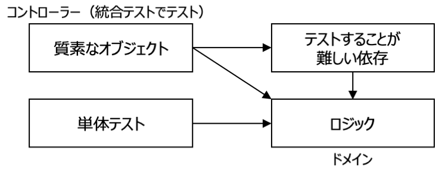

# テストの考え方と実装方法 in Python

[単体テストの考え方／使い方](https://book.mynavi.jp/ec/products/detail/id=136552)


本文書では、**古典学派 (デトロイト学派) の解釈を採用**しています。
また、本文書では、書籍を参考に個人的な意見を含めているため、書籍の内容と異なる場合があります。

本文書の内容について納得できない箇所があれば、書籍を参照してその違いを確認してください。

- [テストの考え方と実装方法 in Python](#テストの考え方と実装方法-in-python)
  - [テストの種類](#テストの種類)
    - [単体テスト (Unit Test) の概要](#単体テスト-unit-test-の概要)
    - [統合テスト (Integration Test) の概要](#統合テスト-integration-test-の概要)
    - [E2E (End to End Test) の概要](#e2e-end-to-end-test-の概要)
  - [テストを実装する理由](#テストを実装する理由)
  - [共有依存 (shared dependency)](#共有依存-shared-dependency)
  - [プライベート依存 (private dependency)](#プライベート依存-private-dependency)
    - [プライベートな不変依存](#プライベートな不変依存)
      - [値オブジェクト (value object)](#値オブジェクト-value-object)
    - [プライベートな可変依存](#プライベートな可変依存)
  - [プロセス外依存](#プロセス外依存)
    - [管理下にある依存 (managed dependency)](#管理下にある依存-managed-dependency)
    - [管理下にないプロセス外依存 (unmanaged dependency)](#管理下にないプロセス外依存-unmanaged-dependency)
  - [テストの品質の維持](#テストの品質の維持)
  - [網羅率](#網羅率)
    - [コード網羅率 (code coverage)](#コード網羅率-code-coverage)
    - [分岐網羅率 (branch coverage)](#分岐網羅率-branch-coverage)
    - [網羅率をテストスイートの品質としてはいけない理由](#網羅率をテストスイートの品質としてはいけない理由)
  - [品質の良いテストスイートの条件](#品質の良いテストスイートの条件)
    - [テストすることが開発サイクルの中に組み込まれている](#テストすることが開発サイクルの中に組み込まれている)
    - [コードベースの特に重要な部分のみがテスト対象になっている](#コードベースの特に重要な部分のみがテスト対象になっている)
    - [最小限の保守コストで最大限の価値を生み出すようになっている](#最小限の保守コストで最大限の価値を生み出すようになっている)
  - [単体テスト](#単体テスト)
    - [単体テストに求められる要件](#単体テストに求められる要件)
    - [単体テストの構造](#単体テストの構造)
      - [1つのフェーズが複数存在する場合](#1つのフェーズが複数存在する場合)
      - [分岐がある場合](#分岐がある場合)
      - [実行フェーズが1行以上になる場合](#実行フェーズが1行以上になる場合)
      - [テスト後の後始末](#テスト後の後始末)
      - [テスト対象システムの変数名](#テスト対象システムの変数名)
      - [テスト対象の振る舞いの中に分岐がある場合](#テスト対象の振る舞いの中に分岐がある場合)
      - [単体テストの名前](#単体テストの名前)
    - [単体テストの要件](#単体テストの要件)
      - [単体テストの4つの柱](#単体テストの4つの柱)
        - [退行 (regression) に対する保護](#退行-regression-に対する保護)
        - [リファクタリングへの耐性](#リファクタリングへの耐性)
        - [迅速なフィードバック](#迅速なフィードバック)
        - [保守のしやすさ](#保守のしやすさ)
      - [理想的な単体テスト](#理想的な単体テスト)
      - [取るに足らないテスト](#取るに足らないテスト)
    - [ブラックボックステスト](#ブラックボックステスト)
  - [テストダブル](#テストダブル)
    - [テストダブルの種類](#テストダブルの種類)
      - [モック](#モック)
      - [スタブ](#スタブ)
    - [コマンド・クエリ分離の原則 (CQS: Command Query Separation)とモックとスタブ](#コマンドクエリ分離の原則-cqs-command-query-separationとモックとスタブ)
  - [単体テストの手法](#単体テストの手法)
    - [出力値ベーステスト](#出力値ベーステスト)
    - [状態ベーステスト](#状態ベーステスト)
    - [コミュニケーションベーステスト](#コミュニケーションベーステスト)
  - [関数型アーキテクチャ](#関数型アーキテクチャ)
    - [関数型プログラミング](#関数型プログラミング)
    - [関数型アーキテクチャ](#関数型アーキテクチャ-1)
    - [出力値ベーステーストへの移行](#出力値ベーステーストへの移行)
      - [サンプルプロジェクト（訪問者記録システム、vls: Visitor Logging System）](#サンプルプロジェクト訪問者記録システムvls-visitor-logging-system)
      - [ファイルシステムをスタブ／モックに置き換える](#ファイルシステムをスタブモックに置き換える)
      - [関数型アーキテクチャへのリファクタリング](#関数型アーキテクチャへのリファクタリング)
      - [関数型アーキテクチャを採用できないテストケース](#関数型アーキテクチャを採用できないテストケース)
  - [リファクタリング](#リファクタリング)
    - [リファクタリングが必要なコードの識別](#リファクタリングが必要なコードの識別)
      - [ドメインモデル／アルゴリズム](#ドメインモデルアルゴリズム)
      - [取るに足らないコード](#取るに足らないコード)
      - [コントローラー](#コントローラー)
      - [過度に複雑なコード](#過度に複雑なコード)
      - [質素なオブジェクト (Humble Object) を利用した過度に複雑なコードの分割](#質素なオブジェクト-humble-object-を利用した過度に複雑なコードの分割)
      - [サンプルプロジェクト (ユーザー管理システム) について](#サンプルプロジェクト-ユーザー管理システム-について)
      - [ユーザー管理システムのリファクタリング](#ユーザー管理システムのリファクタリング)
    - [ドメインイベントの導入](#ドメインイベントの導入)
  - [統合テスト (integration test)](#統合テスト-integration-test)
    - [統合テストの実装](#統合テストの実装)
    - [統合テストと早期失敗 (Fail First)](#統合テストと早期失敗-fail-first)
    - [統合テストにおけるプロセス外依存の取り扱い](#統合テストにおけるプロセス外依存の取り扱い)
      - [管理下にある依存と管理下にない依存の両方の性質を持つプロセス外依存の取り扱い](#管理下にある依存と管理下にない依存の両方の性質を持つプロセス外依存の取り扱い)
      - [統合テストで実際のデータベースを利用できない場合](#統合テストで実際のデータベースを利用できない場合)
    - [統合テストの作成](#統合テストの作成)
    - [1つのテストケースで複数の実行フェーズを持つ統合テスト](#1つのテストケースで複数の実行フェーズを持つ統合テスト)
    - [ログの出力テスト](#ログの出力テスト)
      - [ログの分類](#ログの分類)
      - [サポートログの出力](#サポートログの出力)
      - [診断ログの出力](#診断ログの出力)
  - [単体テストのアンチパターン](#単体テストのアンチパターン)
    - [プライベートなメソッドやへルパ関数をテストしない](#プライベートなメソッドやへルパ関数をテストしない)
    - [プライベートな状態を公開しない](#プライベートな状態を公開しない)
    - [テストにドメイン知識を導入しない](#テストにドメイン知識を導入しない)
    - [テストのためにプロダクションコードを汚染しない](#テストのためにプロダクションコードを汚染しない)
  - [pythonにおけるテストの実装](#pythonにおけるテストの実装)
    - [テストのファイルシステム構成](#テストのファイルシステム構成)
      - [単体テストの配置](#単体テストの配置)
      - [統合テストの配置](#統合テストの配置)
    - [テストフレームワーク](#テストフレームワーク)
    - [プロダクションコードとテストの実装方法](#プロダクションコードとテストの実装方法)
      - [単体テストの実装手順](#単体テストの実装手順)
      - [統合テストの実装方法](#統合テストの実装方法)
      - [unittest.TestCaseの説明](#unittesttestcaseの説明)
        - [テストメソッド](#テストメソッド)
        - [テストの検証フェーズ](#テストの検証フェーズ)
        - [unittest.TestCaseの実行順序](#unittesttestcaseの実行順序)
      - [unittest.mock.MagicMockの説明](#unittestmockmagicmockの説明)
        - [属性値を与える](#属性値を与える)
        - [戻り値を与える](#戻り値を与える)
        - [例外をスローする](#例外をスローする)
        - [指定した関数の戻り値を返す](#指定した関数の戻り値を返す)
        - [モックの呼び出しを確認](#モックの呼び出しを確認)
      - [パッチの説明](#パッチの説明)
        - [unittest.mock.pathの使用方法](#unittestmockpathの使用方法)
        - [unittest.mock.patch.objectの使用方法](#unittestmockpatchobjectの使用方法)
        - [unittest.mock.patch.dictの使用方法](#unittestmockpatchdictの使用方法)
  - [単体テストの実装演習](#単体テストの実装演習)
    - [Todo Tree拡張機能のインストール](#todo-tree拡張機能のインストール)
    - [テストの実装を連取するサンプルプロジェクトの説明](#テストの実装を連取するサンプルプロジェクトの説明)
    - [商品クラスと単体テストの実装](#商品クラスと単体テストの実装)
    - [単体テストの実行方法](#単体テストの実行方法)
    - [会員区分クラスと単体テストの実装](#会員区分クラスと単体テストの実装)
    - [顧客クラスと単体テストの実装](#顧客クラスと単体テストの実装)
    - [消費税と単体テストの実装](#消費税と単体テストの実装)
    - [消費税マネージャークラスと単体テストの実装](#消費税マネージャークラスと単体テストの実装)
      - [適用される消費税の税率](#適用される消費税の税率)
      - [消費税リストに消費税を追加](#消費税リストに消費税を追加)
        - [新しく追加する消費税の期間を含む消費税が消費税リストに存在する場合](#新しく追加する消費税の期間を含む消費税が消費税リストに存在する場合)
        - [新しく追加する消費税の期間を含む消費税が消費税リストに存在しない場合](#新しく追加する消費税の期間を含む消費税が消費税リストに存在しない場合)
        - [単体テスト](#単体テスト-1)
      - [消費税の税額を変更する](#消費税の税額を変更する)
      - [消費税を削除する場合](#消費税を削除する場合)
    - [売上明細と単体テストの実装](#売上明細と単体テストの実装)
    - [売上と単体テストの実装](#売上と単体テストの実装)
      - [イニシャライザ](#イニシャライザ)
      - [売上明細の追加](#売上明細の追加)
      - [売上明細の削除](#売上明細の削除)
    - [ユースケースの実装とその単体テストの実装](#ユースケースの実装とその単体テストの実装)
      - [リポジトリとリポジトリマネージャーの定義](#リポジトリとリポジトリマネージャーの定義)
      - [消費税ユースケースの実装](#消費税ユースケースの実装)
  - [統合テストの実装演習](#統合テストの実装演習)
    - [割引率、消費税率](#割引率消費税率)
    - [sqlite3の外部参照制約](#sqlite3の外部参照制約)
    - [`termcolor`パッケージのインストール](#termcolorパッケージのインストール)
    - [具象リポジトリと統合テストの実装](#具象リポジトリと統合テストの実装)
  - [依存関係の注入 (Dependency Injection: DI)](#依存関係の注入-dependency-injection-di)
    - [ドメイン](#ドメイン)
    - [クリーンアーキテクチャ](#クリーンアーキテクチャ)
  - [網羅率の計測](#網羅率の計測)
    - [網羅率の計測方法](#網羅率の計測方法)
      - [網羅率の確認方法](#網羅率の確認方法)
      - [網羅率レポートの出力方法](#網羅率レポートの出力方法)

## テストの種類

- `単体テスト (Unit Test)`
- `統合テスト (Integration Test)`
- `E2Eテスト (End to End Test)`


### 単体テスト (Unit Test) の概要

- **テストの実行が自動化**されていること
- **1単位の振る舞い (a unit of behavior)** を検証すること
- **実行時間が短い**こと
- **他のテストケースから隔離**して実行できること

単体テストでは、関数やクラスのメソッドなど、**1つの振る舞い**を検証します。

また、実行時間を短くすることで、**繰り返し単体テストを実行**できるように開発者の負担を軽減します。
実行時間が長くなると、開発者がテストを実行する回数が減り、バグを見つけるまでの時間が長くなります。
バグが見つかるまでの時間が長くなると、それまでにコードベースは大きくなるため、バグの特定と修正に時間がかかるようになります。

さらに、それぞれの単体テストが他の単体テストから独立することで、他からの影響を受けず、個別に実行できるようになります。
これにより、単体テストを**個別に実行**したり、同時に複数の単体テストを**並行／並列で実行**することができます。

単体テストは、データベースや外部のメール送信サービスなどの`依存`を、その動作を模倣する`スタブ`や`モック`などの`テストダブル`に置き換えます。

### 統合テスト (Integration Test) の概要

統合テストは、システム全体が意図したように機能することを検証するテストです。
システムの`ユースケース`ごとに、統合テストを実装して、それぞれを単独または連続して実行します。

統合テストは、データベースを直接使い、外部のメール送信サービスなどの依存をテストダブルに置き換えます。

### E2E (End to End Test) の概要

E2Eテストは、統合テストの上位に位置するテストです。
E2Eテストは、ほぼすべての依存を実際のサービスを使用してテストします。

E2Eテストは、本書の説明対象外とします。

## テストを実装する理由

テストを実装する理由は、システムが**将来も持続的に成長できるようにするため**です。

なお、テストが実装されているシステムのことを`テスト対象システム (SUT: System Under Test)`と呼びます。

> 本説明では。テスト対象オブジェクトのこともSUTと読んでいます。

ほとんどのシステムは、リリース後に何度も仕様変更や改修が行われ、その中で`リファクタリング`されます。
単体／統合テストが実装されていれば、プロダクションコードの改修や追加で、変更されていない部分に影響を与えていないことを確認できます。

変更によりシステムに不具合が発生することを`退行 (regression)`と呼びます。
SUTは、この退行を防ぐことができ、仕様変更や改修に対する開発者の負担を軽減します。

逆に、SUTでないシステムの変更は、変更がシステムに影響を与えているかを確認する工数が多くなり、開発者の負担が大きくなります。
この負担は、開発者のモチベーションを下げ、システムを変更しない理由となり、**システムの成長を妨げます**。

システムのコードベースは、リリース直後から成長を開始して劣化する傾向があり、エントロピー（無秩序の量）が増大します。
このため、リファクタリングが必要になりますが、SUTはリファクタリングによる退行を生み出す可能性が低くなり、リファクタリングに対する開発者の心理的不安を減らすことができます。

逆に、一時的に作成するプログラムなど、成長しない／成長を見込めないシステム（プログラム）は、簡易的なテストで済ましたり、テストの実装を省くことができると考えられます。

次の図は、プロダクションコードとテストコードをリファクタリングなどで適切に保守したSUTと、SUTでないシステムについて、システムの成長と実装に費やす時間を示しています。
初期はSUTの方が実装に費やす時間が大きくなりますが、コードベースが大きくなるにつれて、SUTの方が実装に費やす時間が少なくなります。


また、テストの実装しやすさから、プロダクションコードが適切に実装されているかを測ることができます。
テストを実装しにくいプロダクションコードは、その設計に問題がある可能性があります。
テストを実装しにくいプロダクションコードをリファクタリングすることで、テストの実装が容易になり、プロダクションコードの品質が向上します。

## 共有依存 (shared dependency)

`共有依存 (shared dependency)`とは、データベースなどテストケース間で共有される依存を示します。
共有依存を扱うテストケースを同時に実行すると、お互いがテストに影響を与えるため、正常にテストが実行されなくなる場合があります。

単体テストにおいて、共有依存を`モック`や`スタブ`などの`テストダブル`に置き換えることで、単体テスト同士が影響を与えないようにします。
テストダブルについては、後で説明します。

## プライベート依存 (private dependency)

`プライベート依存 (private dependency)`とは、テストケースで共有されない依存で、`可変依存`と`不変依存`があります。

単体テストにおいて、プライベート依存は、1つのSUTからしか参照されないため、テストダブルで置き換えずそのまま使用します。

### プライベートな不変依存

データが不変で、1つのSUTからしか使用されない場合、`プライベートな不変依存`となります。
プライベートな不変依存には、`値オブジェクト (value object)`などがあります。

#### 値オブジェクト (value object)

`ドメイン駆動設計 (Domain Driven Design: DDD`における値オブジェクトは、次の特徴を持ちます。

- 不変 (immutable: イミュータブル)
- 同一性を持たない (IDや識別子を持たない)
  - 同じ属性を持つ値オブジェクトは等価である
- 小さい属性の集合

`value_objects`モジュールに、住所を表現する値オブジェクトをクラスで、色を表現する値オブジェクト列挙型で示したため参照してください。

### プライベートな可変依存

データが可変で、1つのSUTからしか参照されない場合、`プライベートな可変依存`となります。
プライベートな可変依存には、ファイルシステムに作成された、1つのSUTからしか参照されないファイルなどがあります。

## プロセス外依存

システムは、データベースやメール配信サービスなど、システムが動作するプロセスとは異なるプロセスで動作する`プロセス外依存`があります。
このプロセス外依存は、次の2つに分類されます。

- `管理下にあるプロセス外依存 (managed dependency)`
- `管理下にないプロセス外依存 (unmanaged dependency)`

### 管理下にある依存 (managed dependency)

`管理下にあるプロセス外依存`は、SUTしかアクセスしないデータベースなど、SUTが自由に操作でき、その振る舞いを確認できる依存を示します。

単体テストでは、管理下にある依存をテストダブルで置き換え、テストの実行時間を短くします。
一方、統合テストでは、管理下にある依存を実際に利用したテストを実装します。

### 管理下にないプロセス外依存 (unmanaged dependency)

`管理下にないプロセス外依存`は、外部サービスなど、費用や過度に負荷を与えることができないなどの理由でSUTが自由に操作できない依存を示します。
管理下にない依存は、単体テスト及び統合テストでテストダブルに置き換えます。

## テストの品質の維持

テストの品質が悪いとは次の状態を指します。

- エラーが発生してテストを実行できない
- `偽陽性 (False Positive)` が発生する
  - プロダクションコードが正しいにも関わらず、テストに失敗する
- `偽陰性 (False Negative)` が発生する
  - プロダクションコードが誤っているにも関わらず、テストに成功する

テストの品質が悪いとテストが信頼されなくなり、テストが実行されなくなった結果、**システムの持続的な成長が阻害**されます。

よって、テストの品質を維持するためには、次を心がける必要があります。

- プロダクションコードのリファクタリングに合わせて、テストをリファクタリングする。
- プロダクションコードを変更するたびに、テストを実行する。
- テストが偽陽性や偽陰性を発生した場合は、修正する。

テストコードのリーディングは、プロダクションコードがどのように振舞っているかを把握するために非常に役に立ちます。
よって、プロダクションコードだけでなくテストコードの品質も維持する必要があります。

## 網羅率

`テストスイート（テスト全体）`の品質を評価する指標として`網羅率`があります。
一般的に、網羅率を高く維持することが求められますが、網羅率は**テストスイートの品質が悪いことを評価できますが、良いことを評価できません**。
つまり、**網羅率が低いときのみ、テストスイートの品質が悪いと評価できます**。
逆に、**網羅率が高い場合に、テストスイートの品質が良いとは評価できません**。

網羅率には次の2つがあります。

- `コード網羅率 (code coverage)`
- `分岐網羅率 (branch coverage)`

### コード網羅率 (code coverage)

コード網羅率は、テストスイートがプロダクションコードの行をどれだけ実行したかで計算されます。

$コード網羅率 = \frac{テストスイートが実行した行数}{プロダクションコードの行数}$

次の`is_string_long`関数のコード網羅率を考えます。

```python
def is_string_long(s: str) -> bool:   # 1
    if len(s) > 5:                    # 2
        return True                   # 3
    return False                      # 4

import unittest
class TestIsStringLong(unittest.TestCase):
    def test_is_string_long(self):
        result = is_string_long("abc")
        self.assertFalse(result)
```

上記の場合、`len(s)`は`3`であるため、1, 3, 4行目が実行され、コード網羅率は0.75 (3 / 4)になります。

しかし、`is_string_long`関数を次に変更したとき、コード網羅率は1.0になります。
プロダクションコードのリファクタリングによりテストの品質は向上していませんが、コード網羅率は0.75から1.0に向上しています。

```python
def is_string_long(s: str) -> bool:
    return True if len(s) > 5 else False
```

**コード網羅率はプロダクションコードの実装方法で結果が変わる**ため、コード網羅率だけでテストスイートの品質を判断することはできません。

### 分岐網羅率 (branch coverage)

分岐網羅率は、テストスイートがプロダクションコードに存在する分岐した経路を、どれだけ実行したかで計算されます。

$分岐網羅率 = \frac{テストスイートが実行した分岐数}{プロダクションコードの分岐数}$

リファクタリング前後の`is_string_long`関数の分岐網羅率はどちらも0.5です。

ここで、次のように関数から返された結果を検証しない**邪悪な**`確認不在のテスト`を実装すると、分岐網羅率は1.0になります。

```python
class TestIsStringLong(unittest.TestCase):
    def test_is_string_short(self):
        result = is_string_long("abc")
        # アサーションがななく、関数から返された結果を検証していない

    def test_is_string_long(self):
        result = is_string_long("abcdef")
        # アサーションがななく、関数から返された結果を検証していない
```

上記のテストは、`is_string_long`関数の分岐をすべて実行していますが、関数の結果である`result`を評価していません。

### 網羅率をテストスイートの品質としてはいけない理由

網羅率をテストスイートの品質としてはならない理由は次の通りです。

- プロダクションコードの実装方法によってコード網羅率が変わる
- 分岐網羅率を増やすために、確認不在のテストが実装される

基本的に網羅率を高く維持されていれば、確認不在のテストが存在しない限り、**よくテストされている**とみなせます。
しかし、網羅率を例えば85%以上に維持するなど、数値目標を設定することは、開発者に**人工的な目標**を設定することになり、テストスイートの品質を向上させることに繋がりません。

## 品質の良いテストスイートの条件

- **テストすることが開発サイクルの中に組み込まれている**
- **コードベースの特に重要な部分のみがテスト対象になっている**
- **最小限の保守コストで最大限の価値を生み出している**

### テストすることが開発サイクルの中に組み込まれている

テストは常に実行されなければならず、テストの実行が開発サイクルの中に組み込まれていなくてはなりません。
理想的には、仮に些細な変更であっても、コードが変更されるたびにテストが実施されるようになっていることです。
**テストは実行されて、初めて価値を持ちます**。

チーム開発している場合、リモートリポジトリの`develop`または`main`ブランチにプッシュされるたびに、`CI/CDパイプライン`が自動で実行されることが望ましいです。

### コードベースの特に重要な部分のみがテスト対象になっている

ほとんどのシステムにおいて、システムの核はビジネスロジックを含むコードで、それらは**ドメイン**または**ドメインモデル**と呼ばれます。
テストの実装及び実行に費やした時間が価値として効果的に得られるのは、ドメインに対するテストです。

逆に価値の低いコードには、次などが挙げられます。

- インフラに関するコード
- フレームワーク、ライブラリ、データベースまたは外部サービスなど依存関係に関するコード
- インターフェイスなど、構成要素同士を結びつけるコード

ドメインをテストしやすくするために、**ドメインは価値の低いコードと分離**する（`疎結合`にする）必要があります。
また、テストの価値を高めるために、**ドメインとドメイン以外を区別する能力**を発揮して、価値の高いテストを優先して実装するようにしてください。

### 最小限の保守コストで最大限の価値を生み出すようになっている

単体テストにおいて、最小限の保守コストで最大限の価値を生み出すことは非常に難しいです。
これをできるようになるためには、次の能力が必要です。

- 価値のあるテストケースを認識できること
  - 逆に、価値の低いテストケースを認識できること
- 価値のあるテストケースを作成できること

価値のあるテストケースを認識することと、作成できることは異なる能力です。

## 単体テスト

**単体テストは、ビジネスシナリオにおけるハッピーパスと可能な限り多くの異常ケース検証**します。

ここで、ハッピーパスとは、ビジネスシナリオが正常に終わる実行経路を示します。
また、異常ケースとは、ビジネスシナリオの実行がエラーで終わる場合を示します。

### 単体テストに求められる要件

繰り返しになりますが、古典学派 (デトロイト学派) の解釈において、単体テストには次の要件が必要です。

- テストの実行が自動化されていること
- 1単位の振る舞い (a unit of behavior) を検証すること
- 実行時間が短いこと
- 他のテストケースから隔離して実行できること

### 単体テストの構造

単体テストは、次で構成される`AAAパターン`で実装します。

- `準備 (Arrange)`
- `実行　(Act)`
- `検証　(Assert)`

```python
# calculator/__main__.py
import unittest


# プロダクションコード
class Calculator:
    """計算機クラス"""

    def add(self, a: int, b: int) -> int:
        """2つの整数を足し算した結果を返す。

        Args:
            a (int): 演算子の左辺の値
            b (int): 演算子の右辺の値

        Returns:
            int: 2つの整数を足し算した結果
        """
        return a + b


# テストコード
class CalculatorTest(unittest.TestCase):
    """計算機テストクラス"""

    def test_add_two_numbers(self) -> None:
        """2つの整数を足した結果が正しいことを確認するテスト"""
        # 準備 (Arrange)
        calculator = Calculator()
        a = 1
        b = 2

        # 実行 (Act)
        result = calculator.add(a, b)

        # 検証 (Assert)
        self.assertEqual(result, 3)


if __name__ == "__main__":
    unittest.main()
```

準備フェーズでは、テストケースの事前条件を満たすようにSUTとその依存の状態を設定します。

実行フェーズでは、メソッドや関数を呼び出しなど、SUTの振る舞いを実行します。
SUTから結果が返ってくる場合は、その結果を変数に格納します。

検証フェーズでは、SUTの振る舞いの結果が期待通りであるかを確認します。
振る舞いの結果には次などがあります。

- SUTからの戻り値
- SUTが振る舞った後の、SUTの状態
- SUTが振る舞った後の、協力者オブジェクトの状態
- SUTが振る舞った後の、協力者オブジェクトのメソッドまたは関数の呼び出し回数

#### 1つのフェーズが複数存在する場合

1つのフェーズが複数存在するテストケースは、1単位の振る舞いではなく**複数の振る舞い**を検証している可能性があります。
この場合、テストケースを分割して、1単位の振る舞いを検証するようにします。

テストケースを分割できない場合、そのテストを結合テストとして実装した方が適切な場合があります。

#### 分岐がある場合

分岐があるテストケースは、1単位の振る舞いを検証していない可能性があります。
この場合、分岐の数だけテストケースを分割して、それぞれのテストケースで1単位の振る舞いを検証するようにします。

#### 実行フェーズが1行以上になる場合

通常、実行フェーズのコードは1行です。
もし、実行フェーズが複数行になった場合、SUTのメソッドなどのAPIが適切でない可能性があります。
この場合、SUTをリファクタリングして、それぞれのメソッドが1単位の振る舞いをするように改善します。

テストの実装が煩雑になる場合、***SUTの設計が適切でない***可能性があります。

次の単体テストでは、実行フェーズで購入と在庫の更新を行っています。
もし、開発者が購入するAPIを発行した後、在庫を更新するAPIを発行しなかった場合、のドメイン`不変条件`が破られ、システムの在庫管理が破綻します。
なお、不変条件とは、**常に成立しなくてはならない条件**を示します。

$購入前の在庫数 = 購入後の在庫数 + 購入数$

よって、`Customer`クラスの`purchase`メソッドは、購入する商品、購入する商品数及び店舗を受け取り、そのメソッドの中で在庫の更新をする必要があります。

```python
# 実行フェーズが1行以上になり、SUTの設計が適切でないケース
class PurchaseTest(unittest.TestCase):
    def test_purchase_succeeds_when_enough_inventory(self) -> None:
        """在庫が十分にあるときに、購入が成功することを確認"""
        # 準備
        store = Store()
        store.add_inventory(Product.SHAMPOO, 10)
        customer = Customer()

        # 実行
        success = customer.purchase(store, Product.SHAMPOO, 5)  # 購入
        store.remove_inventory(Product.SHAMPOO, 5) # 在庫の更新

        # 確認
        self.assertTrue(success)
        self.assertEqual(5, store.get_inventory(Product.SHAMPOO))
```

#### テスト後の後始末

基本的に、単体テストは、プロセス外依存ではなくそれを置き換えたテストダブルとやり取りするため、テスト後の後始末は必要ありません。
後始末が必要なテストがある場合、そのテストを統合テストとして実装することを検討してください。

#### テスト対象システムの変数名

多くの依存を扱う単体テストでは、単体テストのコードでテスト対象システムと依存を区別することが難しくなる場合があります。
テスト対象システムには、`sut`という変数を使用することを検討してください。

#### テスト対象の振る舞いの中に分岐がある場合

SUTの振る舞いの中に分岐がある場合、分岐の数だけテストケースを実装することになります。
このとき、準備フェーズにおけるSUTや依存の準備が煩雑な場合、それぞれのテストケースで煩雑な準備をするのではなく、それらを準備する`ヘルパー関数`を実装して、**単体テスト間で共有**するようにしてください。

ヘルパー関数により、単体テストのコードが簡潔になり、保守性が向上するとともに見通しが良くなります。

#### 単体テストの名前

単体テストに名前をつけるときの指針を次に示します。

- DDDにおいて`ビジネスエキスパート`と呼ばれる問題領域に精通する非開発者が、どのようなことを検証しているかが伝わるような名前をつける
- 英語で名前をつける場合は、`_`で単語を区切る
- 厳密な命名規則に縛られないようにする

`<メソッド名>_<事前条件>_<予期した結果>`のような命名規則がありますが、この命名方法は振る舞いではなく**実装の詳細に着目しているため適切ではありません**。
基本的に、SUTの**メソッドや関数の名前をテスト名に含めない**ようにしてください。

単体テストの名前を英語にする必要はありません。
単体テストの名前は日本語でも構いませんが、`unittest`モジュールがテストできるように、名前の先頭に`test_`を付けてください。

- ex: `test_無効な日付が指定された配達は不正だと判断されることを確認`

```python
class CalculatorTest(unittest.TestCase):
    def test_add_two_numbers(self) -> None:   # GOOD
        """2つの数値を加算することを確認"""
        # テストコード

    def test_add_two_numbers_returns_sum(self) -> None:  # BAD
        """2つの数値を加算した結果を返すことを確認"""
        # テストコード


class DeliveryDispatcherTest(unittest.TestCase):
    def test_delivery_with_invalid_date_should_be_considered_invalid(self) -> None: # GOOD
        """無効な日付が指定された配達は不正だと判断されることを確認"""
        # テストコード

    def test_is_delivery_valid_invalid_date_returns_false(self) -> None:  # BAD
        """is_delivery_validメソッドは無効な日付を渡したときFalseを返すことを確認"""
        # テストコード
```

上記、それぞれのテストクラスの1つ目の名前は、振る舞いを簡潔に表現する適切な名前と考えられます。
しかし、2つ目の名前は、実装の詳細を表現しており、テストでどのような振る舞いを検証しているか把握することが難しくなっています。

### 単体テストの要件

#### 単体テストの4つの柱

- **退行 (regression) に対する保護**
- **リファクタリングへの耐性**
- **迅速なフィードバック**
- **保守のしやすさ**

テストの正確性は、次のように判定されます。


偽陰性に対しては、退行に対する保護を可能な限り備えるようにします。
偽陽性に対しては、リファクタリングへの耐性を可能な限り備えるようにします。

##### 退行 (regression) に対する保護

単体テストを実装することで、新しい機能を追加した後に、変更されていない部分にバグが生じていないか (退行を発生させていないか) 確認します。
もし、プロダクションコードに退行が発生した場合、単体テストに失敗するため、すぐに退行に対応できます。

単体テストを実装することで、プロダクションコードを変更しても退行が発生しないことに自信を持てるようになり、**システムの持続的な成長を期待できます**。

退行に対する保護を最大限に備えるためには、**テストで可能な限り多くのプロダクションコードを実行**して、**コード網羅率を高く維持**する必要があります。

##### リファクタリングへの耐性

`リファクタリングへの耐性`とは、テストが失敗することなく、プロダクションコードをリファクタリングできることです。

プロダクションコードをリファクタリングしたとき、そのコードに誤りがないにも関わらずテストに失敗した場合、そのテストは偽陽性を検出しています。

つまり、リファクタリングへの耐性とは、**リファクタリングしても偽陽性を検出しない性質**を指します。

ほとんどの偽陽性は、リファクタリング後に検出されます。
偽陽性をそのままにしておくと、リファクタリングやテストする意味を損ないます。
その結果、開発者はリファクタリングやテストすることを避けるようになり、問題のあるコードが本番環境に持ち込まれる可能性が高くなり、**システムの持続的な成長を阻害**します。

偽陽性を検出するテストは、`壊れやすいテスト`と呼ばれます。
壊れやすいテストは、SUTの内部実装に着目したテストになっている場合が多く、SUTの振る舞いをリファクタリングして変更した場合、テストに失敗するようになります。

壊れやすいテストの例としては、関数が生成するSQL文を検証するテストがあります。
関数が生成するSQL文を同じ結果を返す異なるSQL文にリファクタリングすると、実装の詳細に着目したテストになり、それは`偽陽性`を検出する可能性があります。

この場合、生成するSQL文を検証するテストを実装するのではなく、生成されたSQL文でデータベースに問い合わせをして、その結果を検証する`統合テスト`に変更する必要があります。

リファクタリングへの耐性を保つためには、**SUTの最終的な結果、つまり振る舞いの結果に着目してテストを実装**しなければなりません。

振る舞いの結果に着目したテストは、`ブラックボックステスト`と呼ばれます。
逆に、内部実装に着目したテストは、`ホワイトボックステスト`と呼ばれます。

また、テストケースを作成する際に最も意識すべきことは、作成するテストケースが問題領域に関する物語を表現することです。
そしてそのテストケースが失敗した場合、テストケースが表現する物語とシステムの振る舞いの間に違いがあることが明らかになり、プロダクションコードまたはテストコードの修正を促すことができます。

##### 迅速なフィードバック

単体テストの実行時間を短くすることで、テストの結果をすぐに確認できるようにします。

##### 保守のしやすさ

単体テストの保守性を維持することで、プロダクションコードが変更された場合に単体テストを変更しやすくします。

また、プロダクションコードの振る舞いを理解するために、単体テストを読みやすくします。

#### 理想的な単体テスト

退行への保護、リファクタリングへの耐性、迅速なフィードバックに3つは互いに排反するため、これら3つをすべて兼ね揃えた単体テストを実装することはできません。

- 統合テストやE2Eテストなど、退行への保護とリファクタリングへの耐性を兼ね揃えたテストは時間がかかるため、迅速なフィードバックを期待できない
- 取るに足らないテストは、リファクタリングへの耐性と迅速なフィードバックを得られるが、基本的に退行が発生しないため、退行への保護を備える価値がない
- 壊れやすいテストは、退行への保護と迅速なフィードバックを得られるが、前述の通りリファクタリングへの耐性を備えることができない

テストケースの価値は、それぞれの要件を備えた度合いの積で表現されるため、4つの柱を備える度合いを、少なくとも0より大きくする必要があります。

$テストケースの価値 = 退行への保護 \times リファクタリングへの耐性 \times 迅速なフィードバック \times 保守のしやすさ$

また、リファクタリングへの耐性は、完全に備えるか全く備えないかの2択になるため、リファクタリングへの耐性は必ず備える必要があります。

よって、理想的な単体テストは、リファクタリングへの耐性と保守のしやすさを備えており、退行への保護と迅速なフィードバックを備える度合いを、それぞれのテストケースで調整する必要があります。


> 単体テストでは、時間が短いことが要件になるため、退行への保護と迅速なフィードバックを両立できます。
> しかし、統合テストでは管理可能なプロセス外依存を扱うため、テストの実行時間が長くなり、退行への保護と迅速なフィードバックを両立できない場合があります。
> 書籍では、単体テストの章で退行への保護と迅速なフィードバックの調整が示されていますが、これは統合テストまたはE2Eテストに適用される内容だと考えられます。

#### 取るに足らないテスト

取るに足らないテストとは、実装を間違えにくい`プロパティ`などを検証するテストを示します。

取るに足りない機能とそのテストは、`boring`モジュールを参照してください。

### ブラックボックステスト

ブラックボックステストは、ソフトウェアテストの一種で、ソフトウェアの内部構造や動作の仕組みを知らずに、外部から見たソフトウェアの機能を検証するテスト手法です。

ブラックボックステストでは、次などのテスト手法が用いられます。

- `同値分割法`: 入力データを成功または失敗などのグループに分け、各グループの代表的な値をテストします。
- `境界値分析`: 入力データの境界値（例えば、最大値や最小値）付近を重点的にテストします。
- `決定表`: 複雑なロジックや条件を表形式で整理し、その組み合わせをテストします。

ブラックボックステストの利点を次に示します。

- ソフトウェアの内部構造を知る必要がないため、第三者がテストを実装できます。
- ユーザー視点でのテストができるため、実際のユースケースで発生するバグを発見できます。

ブラックボックステストの欠点を次に示します。

- 内部構造を考慮しないため、特定のコードパスや条件を網羅的にテストできない場合があります。

同値分割法及び境界値分析を用いたブラックボックステストは、`black_box`モジュールを参照してください。

`black_box`モジュールの境界値分析を用いたテストケースでは、`境界値`となる17才と18才に加えて16才と19才のテストケースを実装しています。
これは、誤って大人を判定する式が`year == 18`と実装されていた場合に、19才を判断するテストが失敗するようにするためです。
境界値分析では境界値だけでなく境界値よりも1単位小さいまたは大きい値をテストケースに含めるようにしてください。

## テストダブル

### テストダブルの種類

テストダブルは、次の2つの種類に分類できます。

- `モック`
- `スタブ`


#### モック

モックは、SUTからSUTが依存するオブジェクトに向かうコミュニケーションを模倣するオブジェクトです。
モックは、メソッドの呼び出し回数や引数を記録して後で検証できます。

モックは、テストフレームワークを利用して作成することがほとんどで、pythonでは`unittest.mock.Mock`または`unittest.mock.MagicMock`クラスを利用できます。
`unittest.mock.MagicMock`クラスは、`unittest.mock.Mock`クラスのすべての機能と、`__getitem__`などの`マジックメソッド`を自動的にモックします。

単体テストでは、個々の機能を分離して1つの振る舞いをテストします。

例えば、実際にデータベースにアクセスしてユーザーの数を取得する`retrieve_number_of_users`関数があったとします。
そして、`UserQuery`クラスの`number_of_users`メソッドは、そのメソッドの内部で`retrieve_number_of_users`関数を呼び出しているとします。

`UserQuery`クラスの`number_of_users`メソッドをテストする場合、内部で呼び出す`retrieve_number_of_users`関数が色々な値を返すとテストがしにくくなります。
よって、`UserQuery`クラスの`number_of_users`メソッドが呼び出す`retrieve_number_of_users`関数をモックして、あらかじめ予期したデータを返却するようにします。

`retrieve_number_of_users`関数、`UserQuery`クラスとそのテストクラスは、`magic_mock`モジュールを参照してください。

ここで、`magic_mock/__main__.py`では、`magic_mock.user_query`の名前空間にインポートした、`retrieve_number_of_users`という名前で参照できる関数をモックしていることに注意してください
(`magic_mock`名前空間に存在する実際の`retrieve_number_of_users`関数をモックしているわけではありません)。

```python
import unittest
from unittest.mock import MagicMock

import magic_mock.user_query  # <- ここ
from magic_mock.user_query import UserQuery


class UserQueryTest(unittest.TestCase):
    """ユーザークエリテストクラス"""

    def test_number_of_users(self) -> None:
        # snip

        magic_mock.user_query.retrieve_number_of_users = MagicMock( # <-- ここ
            return_value=100
        )

        # snip
```

#### スタブ

`スタブ`は、SUTが依存するオブジェクトからSUTに向かうコミュニケーションを模倣するオブジェクトです。
`スタブ`は、SUTに対して固定の応答を返すため、SUTの振る舞いをテストしやすくなります。
`スタブ`は、開発者が実装する必要があります。

```python
class ApiStub:
    def fetch(self) -> Dict:
        return {"data": "sample data"}


class FooTest(unittest.TestCase):
    def test_fetch_data(self) -> None:
        api = ApiStub()
        foo = Foo(api)
        result = foo.fetch_data()
        self.assertEqual(result, {"data": "sample data"})
```

### コマンド・クエリ分離の原則 (CQS: Command Query Separation)とモックとスタブ

`コマンド・クエリ分離の原則`とは、関数やメソッドは、何かをする`コマンド`か、問い合わせする`クエリ`のどちらかのみを実行して、両方を実行するべきではないという原則です。
コマンド・クエリ分離の原則を守ることで、関数やメソッドが何をするかを明確にすることができます。

- コマンド: データを変更するなど**副作用を起こして、戻り値がない**
- クエリ: データを変更するなどの**副作用を起こさないで、問い合わせた結果を返す**

よって、SUTが依存しているコマンドに該当する関数やメソッドは、`モック`を使用してテストします。
また、SUTが依存しているクエリに該当する関数やメソッドは、`スタブ`を使用してテストします。

## 単体テストの手法

単体テストには、次の3つの手法があります。

- `出力値ベーステスト`
- `状態ベーステスト`
- `コミュニケーションベーステスト`

単体テストの4つの柱のうち、退行に対する保護、迅速なフィードバックの2つは、単体テスト手法で差がありません。
**リファクタリングへの耐性と保守のしやすさは、3つの手法で差があり、最も備えるのは出力値ベーステストで、最も備えないのはコミュニケーションベーステストです**。

### 出力値ベーステスト

出力値ベーステストとは、SUTに入力値を与え、SUTから返される結果を検証するテストです。
出力値ベーステストは、SUTやその協力者オブジェクトなどの状態が変わらず、協力者オブジェクトのコミュニケーションがない場合に適しています。

出力値ベーステストは、他の2つの手法と比較して**最もリファクタリングへの耐性が高くなります**。

### 状態ベーステスト

状態ベーステストは、SUTの処理が完了した後、次に発生した状態などの副作用を検証する場合に適しています。

- SUT
- 協力者オブジェクト
- データベースやファイルシステムなどのプロセス外依存

状態ベーステストは、副作用の発生を検証するなど、プロダクションコードの実装と結びつきやすくなります。
よって、出力値ベーステストと比較して、壊れやすく、リファクタリングへの耐性が低くなります。

### コミュニケーションベーステスト

コミュニケーションテストは、モックを使用してテスト対象システムとその協力者オブジェクトとのコミュニケーションを検証します。
ここにおけるコミュニケーションとは、協力者オブジェクトのメソッドの呼び出し回数、メソッドの引数、戻り値などを指します。

コミュニケーションベーステストは協力者オブジェクトのコミュニケーションを検証するため、プロダクションコードの実装と結びつきが強くなります。
よって、コミュニケーションベーステストは、他の2つの手法と比較して、**最も壊れやすく、リファクタリングへの耐性が低くなります**。

## 関数型アーキテクチャ

状態ベーステストやコミュニケーションベーステストは、壊れやすく、リファクタリングへの耐性が低いため、これらのテストを可能な限り出力値ベーステストに変更することが望ましいです。

### 関数型プログラミング

`関数型プログラミング`は、`React`のコンポーネントがクラスコンポーネントから関数コンポーネントに置き換えられたように、注目されているプログラミングパラダイムです。
関数型プログラミングは、$y = x^2$など`数学的関数`を用いたプログラミングで、数学的関数は`純粋関数`とも呼ばれます。
純粋関数は、次の特徴があります。

- 隠れた入力や出力を持ちません。
- 同じ入力に対しては、常に同じ出力を返します。
- 状態を変更したり、状態に依存するなど、`副作用`がありません。

純粋関数のすべての入力と出力は、関数の引数と戻り値で表現されています。

```python
# 純粋関数
def add_two_numbers(x: int, y: int) -> int:
    return x + y

# 純粋関数は予測可能で、何回実行しても同じ結果
assert add_two_numbers(1, 2) == 3
assert add_two_numbers(1, 2) == 3

# 副作用がある関数
# a, bは、add_something関数の隠れた入力で、出力に影響を与える
# また、add_something関数は、a, bを変更する副作用がある
a = 1
b = 2
def add_something(x: int) -> int:
    global a
    global b
    result = x + a + b
    a += 1
    b += 1
    return result

# 副作用がある関数は予測が難しく、実行するたびに結果が変わる可能性がある
print(add_something(1))  # 4
print(add_something(1))  # 6
```

隠れた入力と出力には次があります。

- 副作用
- 例外
- 内部もしくは外部の状態の参照

書籍では例外を隠れた出力として扱われていますが、出力値ベーステストで例外を考慮することで特別視する必要はないと考えています。

> クラスやインスタンスメソッドは、基本的にクラスまたはインスタンスの状態に依存するため、純粋関数ではありません。
> それらの状態に依存しないメソッドである場合、メソッドではなく単なる関数として実装した方が良いと考えられます。

### 関数型アーキテクチャ

システムは、ユーザーの情報を記録したり、注文を受け付けて記録するため、副作用なしで構築することは不可能です。
関数型プログラミングの目的は、副作用を完全に取り除くことではなく、**ビジネスロジックを扱うコードと副作用を扱うコードを分離**することです。

`関数型アーキテクチャ`は、可能な限り副作用を処理の最初と最後に移動して、その間にビジネスロジックを配置します。
例えば、関数型アーキテクチャでは、次の順書で処理をします。

1. ビジネスロジックに必要なすべてのデータをデータベースから取得します（状態依存、隠された入力）。
2. ビジネスロジックを実行します（純粋関数）。
3. ビジネスロジックが判断した結果をデータベースに保存します（副作用、隠された出力）。

### 出力値ベーステーストへの移行

#### サンプルプロジェクト（訪問者記録システム、vls: Visitor Logging System）

訪問者記録システムは次の仕様です。

- テキストファイルに訪問者と訪問日時を1行ずつ記録します。
- 最新の訪問者はテキストファイルの最後に記録します。
- テキストファイルに記録されている訪問者の数が上限に達していた場合、新しいテキストファイルに訪問者を記録します。
- 訪問者を記録するテキストファイルは、`visitor_0001.txt`のようにファイルのインデックスをファイル名に含めます。

訪問者記録システムの最初のバージョンは`vls1`モジュールを参照してください。

現在の`VisitorManager`クラスには次の問題があります。

- `VisitorManager`がファイルシステムと`密結合`しており、テストの実装が煩雑になるため、保守のしやすさが得られません。
- テストを実行する前に、訪問者記録ファイルを正しく配置する必要があります。
- テスト終了後に、訪問者記録ファイルを削除する必要があります。
- ファイルシステムは、管理下にないプロセス外依存であるため、並行または並列に実行できません。
- また、テストでファイルシステムを扱う必要があるため、若干、迅速なフィードバックが得られなくなっています。

| 良い単体テストの4本の柱  | 最初のバージョンのテスト |
| ------------------------ | ------------------------ |
| 退行に対する保護         | 良い                     |
| リファクタリングへの耐性 | 良い                     |
| 迅速なフィードバック     | 普通                     |
| 保守のしやすさ           | 悪い                     |

なお、ファイルシステムを扱うテストは、単体テストではなく、統合テストに分類されます。

#### ファイルシステムをスタブ／モックに置き換える

テストがプロセス外依存と密結合している場合、プロセス外依存をスタブやモックに置き換えることで、問題を解決できます。
この場合、プロダクションコードに含まれるファイルシステムに対する操作を`IFileSystem`インターフェイスとして抽出します。
そして、`IFileSystem`インターフェイスを実装するインスタンスを、`VisitorManager`クラスのコンストラクタ（pythonの場合はイニシャライザ）に`注入`するようにリファクタリングします。

これにより、型に厳密なプログラムのプロダクションコードでは`IFileSystem`を実装して、実際にファイルシステムを操作するインスタンスに、単体テストでは`IFileSystem`インターフェイスを実装したモックに置き換えられるようにします。
そして、単体テストでは、モックを介して、訪問者記録ファイルへの書き込みを検証します。

> インターフェイスを介すことでクラスが具体的に依存するのではなく**抽象**に依存するようになります。
> これは、[SOLID原則](https://qiita.com/baby-degu/items/d058a62f145235a0f007)の`依存関係逆転の原則`に該当します。
> そして、依存関係を後から注入することを`DI (Dependency Injection)`と呼びます。

pythonでは、`unittest.mock.MagicMock`を使用する場合、モックに`IFileSystem`インターフェイスを実装する必要はありません。
静的型付け言語では、プロセス外依存にインターフェイスを導入して、プロセス外依存を扱うクラスとそのモックにそのインターフェイスを実装する必要があります。

訪問者記録システムに`IFileSystem`インターフェイスを導入した`vls2`モジュールを参照してください。
また、ファイルシステムをモックに置き換えた単体テストは、`vls2/test_visitor_manager.py`を参照してください。
`vls2`モジュールでは、pythonで`abc`モジュールを利用してインターフェイスを実装する例を示していますが、本来必要のないものです。

単体テストでファイルシステムをモックに置き換えたことで、さらに単体テストから迅速なフィードバックが得られるようになり、単体テストの保守のしやすさも向上しました。
しかし、出力値ベーステストと比較して、単体テストの読みやすさは向上していません。

| 良い単体テストの4本の柱  | 最初のバージョンのテスト |
| ------------------------ | ------------------------ |
| 退行に対する保護         | 良い                     |
| リファクタリングへの耐性 | 良い                     |
| 迅速なフィードバック     | 良い                     |
| 保守のしやすさ           | 普通                     |

ただし、インターフェースを導入して、外部依存をモックに置き換えることで、単体テストを実装しやすくなることを紹介したまでであることにに注意してください。
ここで、実装した単体テストは、検証に成功することが当然であるため、プロダクションコードの品質の向上にまったく役にたっていません。

**外部依存をモックして単体テストの品質が向上しないと判断した場合は、単体テストを実装せず、実際の外部依存を使用した統合テストを実装してください**。

#### 関数型アーキテクチャへのリファクタリング

`VisitorManager`クラスから、副作用を完全に取り除き、`VisitorManager`がビジネスロジックのみを実行するようにリファクタリングします。
`VisitorManager`クラスに判断するために必要な情報を取得したり、実際のファイルシステムに副作用を与える機能は、新たに作成する`VisitorRecordService`クラスに委譲します。

これにより、**ビジネスロジックと、発生する副作用を分離**することができます。
ビジネスロジックを担う`VisitorManager`クラスには、保守しやすい出力値ベースの単体テストを実装します。
また、副作用を伴う`VisitorRecordService`クラスには、統合テストを実装します。

| 良い単体テストの4本の柱  | 最初のバージョンのテスト |
| ------------------------ | ------------------------ |
| 退行に対する保護         | 良い                     |
| リファクタリングへの耐性 | 良い                     |
| 迅速なフィードバック     | 良い                     |
| 保守のしやすさ           | 良い                     |

#### 関数型アーキテクチャを採用できないテストケース

実際のプロダクションコードには、例えば、ビジネスロジックを処理している間に、途中で得た結果を使用して、外部依存からデータを取得する必要があるなど、ビジネスロジックを処理する前にビジネスロジックに必要なすべてのデータを得られない場合があります。

単体テストに関数型アーキテクチャを採用できるのは、SUTが純粋関数の場合のみです。

よって、関数型アーキテクチャを採用できないテストケースでは、モックでそのような外部依存を置き換える必要があります。
すべての単体テストを出力値ベーステストにするのではなく、可能な限り多くの出力値ベーステストを実装することが推奨されます。

## リファクタリング

テストの実装が煩雑になる場合、プロダクションコードの設計に問題がある可能性があります。
この場合、プロダクションコードをリファクタリングする必要があります。

### リファクタリングが必要なコードの識別

プロダクションコードは、次の2つの指標で分類できます。

- **コードの複雑さ、ドメインにおける重要性**
- **協力者オブジェクトの数**

コードの複雑さは分岐の数で計測します。
ドメインにおける重要性は、テスト対象コードがドメインにおいてどれだけ重要かで判断します。

上記指標で、プロダクションコードは、次の4つに分類できます。

- `ドメインモデル／アルゴリズム`
- `取るに足らないコード`
- `過度に複雑なコード`
- `コントローラー`


#### ドメインモデル／アルゴリズム

ほとんどの場合、ドメインモデルには複雑なコードが含まれています。
また、ドメインの問題領域以外で、複雑なアルゴリズムをもつコードがあります。
ドメインモデル／アルゴリズムに該当するコードに実装した単体テストは、他に分類されたコードよりも**高い価値を持ちます**。

#### 取るに足らないコード

取るに足らないコードに該当するコードに実装した単体テストは、**ほとんど価値がありません**。
取るに足らないコードは、単体テストを実装する必要はありません。

#### コントローラー

コントローラーに該当するコードは、複雑なことやドメインに関することを行わないコードですが、多くの協力者オブジェクトが適切に連携するように調整します。
コントローラーに該当するコードに実装した単体テストは、**価値があります**。

コントローラーに該当するコードは、単体テストではなく統合テストを実装することを検討してください。

#### 過度に複雑なコード

過度に複雑なコードは、ドメインにおける重要なコードであり、多くの協力者オブジェクトを使用します。

過度に複雑なコードは、テストすることが最も難しいコードです。
また、過度に複雑なコードをテストしないと、SUTが正常に動作しない可能性が高まり、リスクが高くなります。
このジレンマを解消するためには、過度な複雑なコードをリファクタリングして、ドメインモデル／アルゴリズムまたはコントローラーになるようにコードを分割します。

#### 質素なオブジェクト (Humble Object) を利用した過度に複雑なコードの分割

テストすることが難しくなるのは、非同期や複数スレッドの実行、UI、データベースなどのプロセス外依存とのコミュニケーションなどを担うフレームワークに直接結びついた依存です。

このような依存と結びついたコードをテストするためには、そのコードから**テストしやすい部分を抽出**します。
このテストしやすい部分は、ドメインモデル／アルゴリズムまたはコントローラーに該当するコードになります。

そして、テストしにくい部分を**質素なオブジェクト (Humble Object)**としてコントローラーやサービスクラスとして実装して、テストすることが難しい部分と結びつけます。
このとき、コントローラーやサービスクラスは、ロジックをほぼ含まないようにすることで、質素なクラスをテストする必要がなくなるようにします。



質素なオブジェクトを作成することで、過度に複雑なコードからロジックを抽出できるようになります。
質素なオブジェクトが削除されたロジックは、テストすることを難しくする依存から切り離しできます。
質素なオブジェクトを利用するパターンを利用することで、**ビジネスロジックをすべてのものから隔離**できるようになります。

> 質素なオブジェクトは、[SOLID原則](https://qiita.com/baby-degu/items/d058a62f145235a0f007)の`単一責任の原則`に該当します。

#### サンプルプロジェクト (ユーザー管理システム) について

ユーザー管理システムを例に、過度に複雑なコードを質素なオブジェクトを利用してロジックと外部依存を分離して、質素なオブジェクトを介してロジックと外部依存をコミュニケーションさせる方法を紹介します。

ユーザー管理システムの仕様は次のとおりで、ユーザーのメールアドレスを変更する機能を追加することが求められています。
なお、メッセージバスとは、異なるシステム間でメッセージをやり取りするための通信手段です。

- 登録されたユーザーを管理します。
- ユーザー情報はデータベースに格納します。
- ユーザーのメールアドレスに自社のドメイン名が含まれている場合、そのユーザーの種類を「従業員 (employee)」として登録します。
- ユーザーのメールアドレスに自社のドメイン名が含まれていない場合、そのユーザーの種類を「顧客 (customer)」として登録します。
- 登録されたユーザーのうち従業員の数を管理します。
- もし、ユーザーの種類が従業員から顧客に変更された場合、従業員の数を減らします。
- 逆に、もしユーザーの種類が顧客から従業員に変更された場合、従業員の数を増やします。
- メールアドレスを変更した後、メッセージバスにメッセージを送り、ユーザーのメールアドレスが変更されたことを外部システムに通知します。

最初のバージョンのユーザー管理システムは、`ums1`モジュールを参照してください。

最初のバーションの`User`クラスは、次の特徴があります。

- ビジネスロジックを含むため、ドメインにおける重要性が高いです。
- プロセス外依存かつ協力者オブジェクトであるデータベースとメッセージバスを扱っています。
- ドメインにおける重要性が高く、協力者オブジェクトが多いため、過度に複雑なコードに分類されます。

`django`や`rails`のように、ドメインクラスがデータベースから自身のデータを取得したり保存できるようにする設計パターンを`アクティブレコードパターン`と呼びます。

アクティブレコードパターンは、シンプルな`CRUD (Create Reference Update Delete)`なシステムではうまく機能します。
しかし、コードベースが大きくかつ複雑になると、**ビジネスロジックとプロセス外依存とのコミュニケーションが分離できなくなり、システムの成長が阻害される**場合があります。

#### ユーザー管理システムのリファクタリング

最初のバージョンの`User`クラスは、ビジネスロジックとプロセス外依存が混在しています。また、ユーザーと異なる概念である会社をデータベースから取得する機能を実装しています。

最初のバージョンの`User`クラスは、過度に複雑なコードに分類されるため、次のとおりリファクタリングします。

- `User`クラスはドメインモデルであるため、プロセス外依存を扱うコードを削除します。最初のバージョンの`User`クラスには、プロセス外依存を扱う次のコードがあります。
  - データベースからユーザーを取得するコード
  - データベースにユーザーを記録するコード
  - データベースから会社を取得するコード
  - データベースに会社を記録するコード
  - メッセージバスにユーザーのEメールアドレスの変更を通知するコード
- ユーザーを操作するために必要な情報は、`User`クラスのメソッドの引数として渡すようにします。
- ユーザーのEメールアドレスの変更と会社の従業員数の更新を仲介して、プロセス外依存を扱う`UserService`クラスを質素なオブジェクトとして追加します。
  - 質素なオブジェクトである`UserService`クラスを導入することで、ビジネスロジックとプロセス外依存を分離して、ビジネスロジックをドメインクラスに配置して、ドメインクラスを十分にテストできるようにします。

リファクタリングのユーザー管理システムは、`ums2`モジュールを参照してください。

それぞれのクラスがどのコードに分類されるかを次に示します。

- ドメインモデル／アルゴリズム
  - `User`, `Company`,
- コントローラー
  - `UserService`
- 取るに足らないコード
  - `Repository`, `MessageBus`

リファクタリングにより、過度に複雑なコードが分割され、他のコードに分類されるようになります。
そして、ドメインモデル／アルゴリズムに分類されたコードに対して単体テストを実装して、コントローラーに分類されたコードに対して統合テストを実装します。

リファクタリングにより取るに足らないコードに分類されたコードは、データベースやメッセージバスなどのプロセス外依存になり、おそらくフレームワークやライブラリを利用した単純なコードを実装することになります。
これらのコードをテストしても、フレームワークやライブラリをテストすることになるため、テストを実装しなくても良いと考えられます。

データベースは管理下にあるプロセス外依存、メッセージバスは管理下にないプロセス外依存として扱われます（扱うことにします）。
よって、コントローラの統合テストでデータベースを直接扱い、メッセージバスをモックに置き換えることで、テストは十分だと考えられます。

### ドメインイベントの導入

リファクタリング後のユーザー管理システムには、ユーザーのEメールアドレスが変更されなかった場合も、`UserService`がメッセージバスでユーザーのEメールアドレスの変更を通知する不具合があります。
しかし、`UserService`で現在のEメールアドレスと新しいEメールアドレスが異なっていることを確認するコードを実装することは、ビジネスロジックが`UserService`に漏洩することになり、もしビジネスロジックが変更された場合、漏洩した箇所すべてを変更する煩雑さと、変更忘れなどのリスクがあり、保守しやすさが失われます。

ビジネスロジックを漏洩させず、保守しやすさを損なわないように不具合を解消するためには、`ドメインイベント`を導入して、外部からドメインで発生したイベントを観測可能にします。

ドメインイベントを導入したユーザー管理システムは、`ums3`モジュールを参照してください。

`ums`では、ユーザーに発生したドメインイベントを識別する`UserEventType`列挙型、ユーザーに発生したイベントを表現する`UserEvent`クラスを追加しました。
`UserEvent`クラスには、イベントの詳細を辞書で記録する`event_data`フィールドがあります。

また、`User`クラスに、ユーザーに発生したドメインイベントを管理する`UserEvent`リストを追加しました。

さらに、`UserService`クラスの`change_email`メソッドを、実際にユーザーのEメールアドレスが変更されたときのみ、メッセージバスにその旨を通知するように修正しました。

`ums3`の`UserService`クラスの実装は、ユーザーのEメールアドレスが変更されたかどうかに関わらず、ユーザーと会社をデータベースに保存するため、不必要なパフォーマンスの劣化が発生することがあります。
しかし、ユーザー管理システムにおいて、最終的にユーザーと会社の情報が正しく記録されていることが重要であるため、これを許容します。
これは、実際にユーザーのEメールアドレスが変更されたときのみ、メッセージバス経由で外部システムに通知する要件とは異なっています。

## 統合テスト (integration test)

統合テストは、**システム全体が意図した通りに動作するかを検証**するテストです。
単体テストは、ビジネスロジックを検証するために優れていますが、**ビジネスロジックとプロセス外依存とのコミュニケーションを検証するためには、統合テストが必要**です。

単体テストの性質を再度示します。
統合テストは、単体テストの性質を1つでも満たさないテストに該当します。

- テストの実行が自動化されていること
- 1単位の振る舞いを検証すること
- 実行時間が短いこと
- 他のテストケースから隔離された状態で実行されると

統合テストは、ドメイン／アルゴリズム、とるに足らないコード、コントローラーの4つの分類の内、コントローラーに該当するコードをテストします。

統合テストは、単体テストよりも保守コストが高くなります。
一方、統合テストは、単体テストよりも多くのプロダクションコードを実行するため、**単体テストよりも退行に対する保護が備わります**。
また、統合テストは、ユーザーのユースケースをブラックボックステストするため、単体テストよりもプロダクションコードへの結びつきが弱くなり、**単体テストよりもリファクタリングへの耐性が備わります**。

### 統合テストの実装

統合テストは、**すべてのプロセス外依存とのやり取りを検証できる長いハッピーパス**で実装します。
もし、そのようなハッピーパスが見つからない場合、すべてのプロセス外依存とやり取りできるまでテストケースを増やします。

一般的に、**統合テストは、１件のハッピーパスと単体テストでは検証できないすべての異常ケースを検証**します。

また、一般的に、統合テストのテストケースは、テストピラミッドが示す通り、単体テストよりも少なくなります。
ただし、単純なCRUDシステムの場合、ほぼすべてのコードが取るに足らないコードに分類されるため、統合テストの方が単体テストよりもテストケースの数が多くなる場合があります。

例えば、djangoを使用した単純なCRUDシステムの場合、ほとんどのテストがdjangoフレームワークを介した統合テストになります。

### 統合テストと早期失敗 (Fail First)

何かを処理する前に必ず検証する`確認後実行 (CanExecute / Execute) パターン`をビジネスロジックで実装している場合、その異常ケースを統合テストで実装する必要はありません。

確認後実行パターンは、処理する前に処理が可能か確認して、処理できないと判断した場合は、即座に処理を失敗させます。
この失敗を`早期失敗 (Fail First)`と呼びます。

```python
class User:
    def can_change_email(self, new_email: str) -> bool:
        """Eメールアドレスを変更できる場合はTrue、変更できない場合はFalseを返す"""
        pass

    def change_email(self, new_email: str) -> None:
        """確認後実行パターンを適用したEメールアドレスを変更"""
        # Eメールアドレスを変更できるか確認
        if not self.can_change_email(new_email):
            raise ValueError(
              "Eメールアドレスが誤っているため、ユーザーのEメールアドレスを変更できません。"
        )
        # Eメールアドレスを変更できることを確認できたため、Eメールアドレスを変更
        self.email = new_email


class UserService:
    def change_email(self, user: User, new_email: str) -> None:
        """ユーザーのEメールアドレスを変更"""
        if user.can_change_email(new_email):
            user.change_email(new_email)
```

上記の場合、ユーザーのEメールアドレスを変更できない場合の振る舞いを検証する統合テストは、あまり価値はありません。
仮に、`UserService`クラスで、Eメールアドレスを変更できるか確認するメソッドを呼び出すことを忘れていても、`User`クラスの`change_email`メソッドが失敗するため、Eメールアドレスを変更する処理が中断されます。
また、確認するメソッドの呼び出しを忘れたコードが本番環境に持ち込まれても、上記理由でデータが破壊されることはありません。

ただし、**確認後実行パターンを適用しているコードに対する統合テストの省略は、単体テストで十分にテストされていることが前提です**。

### 統合テストにおけるプロセス外依存の取り扱い

再度、プロセス外依存の種類を示します。

- 管理下にある依存
  - SUT専用のデータベースなど、SUTが単独で自由に取り扱える依存
  - この依存にアクセスするためには、必ずSUTを経由しなくてはならない
  - 上記理由で、SUTと管理下にあるの依存との**コミュニケーションを外部から確認できない**
- 管理下にない依存
  - 外部のメールサービスなど、SUTが単独で自由に取り扱えない依存
  - SUTと管理下にない依存との**コミュニケーションを外部から確認できる**

統合テストにおいて、**管理下にある依存は実際のインスタンスを使用**して、**管理下にない依存はモックに置き換え**ます。

#### 管理下にある依存と管理下にない依存の両方の性質を持つプロセス外依存の取り扱い

管理下にある依存と管理下にない依存の両方の性質を持つプロセス外依存もあります。
代表的な事例として、複数のシステムによるデータベースのテーブルの共有があります。

そもそも、データベースのテーブルの共有は、それぞれのシステムが密結合してしまい、単独で改修することを難しくします。
複数システムによるデータベースのテーブルの共有は、**悪きプラクティス**です。

複数システムによるデータベースのテーブルの共有が避けられない場合、他のシステムからアクセスされないテーブルを管理下にある依存、アクセスされるテーブルを管理下にない依存として扱います。

#### 統合テストで実際のデータベースを利用できない場合

統合テストで実際のデータベースを利用できない場合、**統合テストを実装するべきではありません**。

統合テストでデータベースをモックに置き換えても、統合テストからリファクタリングへの耐性が失われます。
また、リファクタリングへ耐性がないテストは、退行に対する保護も失われます。

### 統合テストの作成

統合テストも、単体テストと同様にAAAパターンで実装します。
ただし、統合テストは、単体テストよりも準備するデータが多くなり、検証する内容も多くなります。
このため、統合テストでは、**統合テスト間でデータを準備する処理や検証する処理を共通化するためにヘルパー関数を作成する**ことが推奨されます。

### 1つのテストケースで複数の実行フェーズを持つ統合テスト

例えば、ユーザーの登録と削除を確認する統合テストでは、次のようなテストケースがあるかもしれません。

1. 準備: ユーザーを登録するために必要なデータを準備
2. 実行: ユーザーを登録
3. 確認: ユーザーが登録されたことを確認
4. 実行: 登録したユーザーを削除
5. 確認: ユーザーが削除されたことを確認

ユーザーを削除する統合テストでは、削除するユーザーを事前に登録する必要があるため、この統合テストは妥当と考えるかもしれません。
しかし、この統合テストは、ユーザーのユースケースをテストしておらず、何を検証するテストケースかが曖昧です。
**統合テストは、ユーザーのユースケースに従って作成**してください。

よって、この場合、ユーザーを登録するテストケースとユーザーを削除するテストケースに分割する必要があります。
ユーザーを削除するテストケースでは、ヘルパ関数を作成して、容易にユーザーを登録できるようにします。
そのようなヘルパ関数は、おそらく他のテストケースでも利用されることになるため便利になります。

### ログの出力テスト

#### ログの分類

システムが出力するログは次の2つに分類されます。

- サポートログ
  - システム運用者はシステム管理者が、システムで発生した特定のイベントを記録するログ
- 診断ログ
  - 開発者がシステムで発生した状況を把握するために記録するログ

サポートログは、ビジネス要求であり、ファイルシステムなどに副作用を発生させる観測可能な振る舞いであるため、統合テストを実素する必要があります。
一方、診断ログは、開発者がシステムの動作を詳細に把握するために出力されるため、統合テストを実装する必要はありません。

なお、システムがサポートログを出力する必要がある場合、サポートログと診断ログを別に出力することを推奨します。
サポートログは専用のクラスを作成して、そのクラスを利用して出力するようにして、診断ログはログフレームワークを利用して出力することもできます。

#### サポートログの出力

サポートログの出力は、副作用を発生させるため、ドメインオブジェクトでログを直接出力すると、ドメインオブジェクトのコードが過度に複雑なコードに分類されることになります。

よって、ユーザー管理システムに導入したドメインイベントと同様に、コントローラーでドメインイベントに発生したイベントを確認して、サポートログを出力するようにします。

`ums3`モジュールの`UserEvent`クラスには、ユーザーに発生したイベントをJSON形式の文字列で表現する`to_json`メソッドを用意してあります。

#### 診断ログの出力

診断ログの出力は、ロギングフレームワークを利用して出力します。

ドメインオブジェクトでロギングフレームワークを利用することは、ドメインオブジェクトとフレームワークが密結合することに繋がります。
しかし、ドメインオブジェクトとフレームワークを分離する理由は、ドメインオブジェクトをテストしやすくするためでした。
しかし、診断ログの出力はテストしませんし、ロギングフレームワークを変更しない限り、ドメインオブジェクトのコードに変更が発生しません。

ただし、単体テストまたは統合テストでは、モックなどを利用して、テストであまり必要とされない診断ログの出力を抑制することを推奨します。

## 単体テストのアンチパターン

### プライベートなメソッドやへルパ関数をテストしない

プライベートなメソッドやへルパ関数をテストすることは、観測可能な振る舞いのみを検証する原則に反します。
プライベートなメソッドやへルパ関数は実装の詳細であり、これらをテストすると、リファクタリングへの耐性を損ないます。

プライベートなメソッドやへルパ関数をテストしていない場合に、網羅率が低くなった場合は、次を確認します。

- デッドコードの存在
- 抽象化の欠落

デッドコードがある場合、そのコードを削除することで網羅率を向上させます。

抽象化の欠落とは、重要なビジネスロジックがプライベートな関数やへルパ関数に存在することを示します。
この場合、ドメイン層に他のクラスを定義して、そのクラスのメソッドに重要なビジネスロジックやへルパ関数の処理を実装します。
その後、そのクラスの単体テストを実装します。

### プライベートな状態を公開しない

単体テストを実行することを目的に、プライベートな状態を公開しないようにしてください。
本来プライベートであるべき状態を、テストするために公開することは、プロダクションコードがテストコードに**汚染された**ことを意味しており、リファクタリングへの耐性を損ないます。

単体テストでは、状態によって変わるクラスの振る舞いを検証するようにしてください。
例えば、割引率を返すクラスに割引する曜日を管理するプライベートな状態があるとします。
この場合、そのクラスには割引率を返すメソッドがあるため、そのメソッドからの戻り値を検証します。

### テストにドメイン知識を導入しない

単体テストにおける検証フェーズで、実行した結果が予期した値と一致するか確認します。
テストコードで、この予期した値を計算するために、プロダクションコードの一部またはすべてを持ち込んではいけません。

このようなテストは、実質的にプロダクションコードと同じ動作をするため、リファクタリングへの耐性を損ない、テストとしての価値はありません。

予期した値は、その値そのものをコードに直接記述することと心がけてください。

### テストのためにプロダクションコードを汚染しない

テストするために、プロダクションコードにテストの場合にのみ実行されるようなコードを追加してはいけません。
このようなコードは、プロダクションコードの見通しを悪くして、保守のしやすさを損ないます。

例えば、プロダクション環境、開発環境、テスト環境で、システムの振る舞いを変更したい場合は環境変数を利用します。
環境変数で現在実行しているシステムが、プロダクション環境かテスト環境かを判断できるようにします。

`python-dotenv`パッケージは、`.env`ファイルに記録されている内容を環境変数に反映します。
この`.env`ファイルに、プロダクション環境かテスト環境かを判断するための環境変数を記述します。

`.env`ファイルには、リポジトリにコミットしたくないパスワードなどの秘匿情報を記述するためにも適しています。

```text
# .env

# production: プロダクション環境
# development: 開発環境
# test: テスト環境
ENVIRONMENT=production
```

```python
import os
from dotenv import load_dotenv

load_dotenv()
environment = os.getenv("ENVIRONMENT")
```

## pythonにおけるテストの実装

### テストのファイルシステム構成

本書では、poetryを利用してプロジェクトを作成することを想定しています。
poetryは、プロジェクトディレクトリの直下に、`tests`ディレクトリを自動的に作成します。

```text
<project dir>
├── <module dir>
│   └── __init__.py
└── tests
    └── __init__.py
```

#### 単体テストの配置

単体テストは、`tests/units`ディレクトリの配下に、プロダクションコードが配置されているディレクトリ構造を再現して配置します。
単体テストは、SUTが実装されているファイルの名前に`test_`を付けたファイルに実装します。
ただし、`__init__.py`に実装されているテスト対象コードのテストを実装する場合は、その`__init__.py`ファイルの親ディレクトリの名前の先頭に`test_`をつけたファイルにテストを実装します。

```text
<project dir>
├── foo
│    ├── __init__.py   # SUTが実装されていない
│    └── foo_a.py
├── bar
│    ├── __init__.py   # SUTが実装されている
│    ├── bar_a.py
│    └── bar_sub
│         ├── __init__.py   # SUTが実装されていない
│         └── bar_sub_a.py
└── tests
     ├── __init__.py
     └── units
          ├── __init__.py
          ├── foo
          │    ├── __init__.py
          │    └── test_foo_a.py
          ├── test_bar.py    # bar/__init__.pyに実装されているテスト対象コードの単体テストを実装
          └── bar
               ├── __init__.py
               ├── test_bar_a.py
               └── bar_sub
                    ├── __init__.py
                    └── test_bar_sub_a.py
```

#### 統合テストの配置

統合テストは、`tests/integrations`ディレクトリに配置します。
なお、`tests/integrations`ディレクトリの下に、ディレクトリを作成して、種類ごとにまとめることもできます。

```text
<project dir>
└── tests
     ├── __init__.py
     └── integrations
          ├── __init__.py
          ├── user_managements
          │    ├── __init__.py
          │    └── test_user_service.py
          └── test_repositories.py
```

### テストフレームワーク

本書では、python公式から提供されている`unittest.TestCase`クラスを継承して、テストケースを実装します。

モックは、`unittest.mock.MagicMock`クラス、`unittest.mock.patch`コンテキストマネージャーまたはデコレーターを使用して作成します。
なお、`unittest.mock.MagicMock`クラスは、`unittest.mock.Mock`クラスにほとんどの`マジックメソッド`のデフォルトの実装を追加したクラスです。
`unittest.mock.MagicMock`クラスを使用することで、自分自身でマジックメソッドを実装する必要がなくなります。

### プロダクションコードとテストの実装方法

`テスト駆動開発 (Test-Driven Development, TDD)`は、次の工程を繰り返して実装する開発手法です。

1. これから記述しようとする関数またはクラスのメソッドのテストを記述します。
2. 上記で実装したテストをパスする必要最低限なプロダクションコードを実装します。
3. プロダクションコードがテストにパスしたら、プロダクションコードをリファクタリングします。
4. 上記1から3を繰り返して、最終的なプロダクションコードに成長させます。

しかし、IDEに言語サーバーが搭載されている場合、プロダクションコードを実装する前にテストを実装すると、IDEから多くのエラーが通知されるなど、開発効率が低下すると考えています。
よって、次の手順で関数またはメソッドなどを実装することを推奨します。

#### 単体テストの実装手順

単体テストは次の手順で実装します。

1. 実装しようとする関数やクラスのメソッドなどについて、シグネチャや振る舞いなどの仕様を決定します。
2. 上記仕様を満たすことを確認するために必要なテストケースを、クラスまたはそのクラスのテストクラスのdocstringに箇条書きで記録します。
3. プロダクションコードを実装します。また、
   プロダクションコードを実装しているときに漏れているテストケースに気付いた場合、docstringにテストケースを追加します。
4. 箇条書きで記録したテストケースを1つ実装して、テストにパスすることを確認します。
   テストにパスしなかった場合、テストにパスするまでプロダクションコードまたはテストを修正します。
5. 必要に応じて、プロダクションコードをリファクタリングします。
6. リファクタリング中に漏れているテストケースに気付いた場合、docstringにテストケースを追加します。
7. リファクタリング後、テストにパスすることを再確認します。
   テストにパスしなかった場合、テストにパスするまでプロダクションコードまたはテストを修正します。
8. リファクタリング後、テストにパスしたら、実装したテストケースをdocstringから削除します。
9. 箇条書きで記録したすべてのテストケースについて、4から8を繰り返します。

テストケースの漏れに気付いた場合、**漏れているテストケースを忘れないように、必ず作業を中断してテストケースをdocstringに追加**してください。
プロダクションコードやテストコードを実装または修正している間に、どのようなテストケースが漏れていたか忘れることがよくあります。

#### 統合テストの実装方法

統合テストは、システムのユースケースごとに作成します。
統合テストのテストケースは、次の手順で実装します。

統合テストのテストケースは、ユースケースをテストするクラスのdocstringに箇条書きで記録します。
統合テストのテストケースの実装コードが長くなる場合、1つのテストケースについて1つのテストクラスを作成してください。

1. 可能な限り多くの依存を実行するハッピーパスを見つけてそのパスをテストケースとして記録します。
2. 上記ハッピーパスで実行されない依存がある場合、その依存を実行するパスをテストケースとして記録します。
3. 単体テストで検証できない異常ケースがある場合、その異常ケースが発生するパスをテストケースとして記録します。
4. 箇条書きで記録したテストケースを1つ実装して、テストにパスすることを確認します。
   テストにパスしなかった場合、テストにパスするまでプロダクションコードまたはテストを修正します。
5. 必要に応じて、プロダクションコードをリファクタリングします。
6. リファクタリング後、テストにパスすることを再確認します。
   テストにパスしなかった場合、テストにパスするまでプロダクションコードまたはテストを修正します。
7. リファクタリング後、テストにパスしたら、実装したテストケースをdocstringから削除します。
8. 箇条書きで記録したすべてのテストケースについて、4から7を繰り返します。

単体テストと同様に、テストケースの漏れに気付いた場合、**漏れているテストケースを忘れないように、必ず作業を中断してテストケースをdocstringに追加**してください。

#### unittest.TestCaseの説明

pythonは、単体テストフレームワークを`unittest`モジュールで提供しています。
単体テストは、`unittest`モジュールが提供する`TestCase`クラスを継承して実装します。

```python
import unittest

class FooTest(unittest.TestCase):
    pass
```

##### テストメソッド

テストは、`TestCase`派生クラスに`test_`で始まるメソッドに実装します。

```python
class FooTest(unittest.TestCase):
    def test_foo(self):
        pass
```

##### テストの検証フェーズ

テストの検証フェーズでは、`TestCase`の`assert*`メソッドを使用して、予期した結果とテスト対象コードが実行した結果を検証します。

また、例外が発生することを検証するためには、`assertRaises`コンテキストマネージャーを使用します。
次の例では、`foo`関数が`ValueError`例外をスローすることを確認しており、`ValueError`例外がスローされない場合は、テストが失敗します。

```python
class FooTest(unittest.TestCase):
    def test_foo(self):
        with self.assertRaises(ValueError):
            foo()
```

なお、スローされる例外の種類と、例外の文字列を正規表現で検証する場合は、`assertRaisesRegex`コンテキストマネージャーを使用してください。

##### unittest.TestCaseの実行順序

`unittest.TestCase`クラスは、テストを開始する前に`setUpClass`メソッドを実行します。
`setUpClass`メソッドでは、その`TestCase`派生クラスのテストケースで共有されるリソースなどを準備するなどします。

`TestCase`クラスは、各テストケースを実行する前に`setUp`メソッドを実行します。
`setUp`メソッドでも、その`TestCase`派生クラスのテストで使用するリソースなどを準備するなどします。

`TestCase`クラスは、各テストが実行された後、`tearDown`メソッドを実行します。
`tearDown`メソッド内では、`setUp`メソッドで準備したリソースやテストで発生した副作用をクリーンアップするなどします。

`TestCase`クラスは、テストケースがすべて実行された後に、`tearDownClass`メソッドが実行します。
`tearDownClass`メソッド内では、`setUpClass`メソッドで準備したリソースやテストで発生した副作用をクリーンアップするなどします。


```python
# testcase_method_order/__main__.py
# ruff: noqa
import unittest


class FooTest(unittest.TestCase):
    @classmethod
    def setUpClass(cls) -> None:
        super().setUpClass()
        print("setUpClass was called!")

    @classmethod
    def tearDownClass(cls) -> None:
        super().tearDownClass()
        print("tearDownClass was called!")

    def setUp(self) -> None:
        super().setUp()
        print("setUp was called!")

    def tearDown(self) -> None:
        super().tearDown()
        print("tearDown was called!")

    def test_foo(self) -> None:
        print("[test case] test_foo was called!")

    def test_bar(self) -> None:
        print("[test case] test_bar was called!")


if __name__ == "__main__":
    unittest.main()
```

```sh
% poetry run python -m testcase_method_order 2> /dev/null
setUpClass was called!
setUp was called!                   # setUp
[test case] test_bar was called!
tearDown was called!                # tearDown
setUp was called!                   # setUp
[test case] test_foo was called!
tearDown was called!                # tearDown
tearDownClass was called!
```

#### unittest.mock.MagicMockの説明

`unittest.mock.MagicMock`クラスは、`unittest.mock.Mock`クラスにほとんどの`マジックメソッド`のデフォルトの実装を追加したクラスです。
`MagicMock`は、モックという名前の通り、クラス、メソッドまたは関数などの代理をして、テストを効率的に実装または実行するために使用されます。

`MagicMock`には次の特徴があります。

- どんな振る舞いも表現できます。
- `drugstore.infra.message_bus`など、任意の名前空間にモックをねじ込む`パッチ`機能を提供します。
- ねじ込んだモックがどのように使用されたかを記録する`キャプチャ`機能を提供します。
  - どのようなメソッドが呼び出されたか
  - メソッドを何回呼び出されたか
  - メソッドが呼び出されたときの引数は何か

##### 属性値を与える

`MagicMock`インスタンスに属性値を与える場合、インスタンスを作成するときにキーワード引数で属性値を与えます。
また、インスタンスを作成した後で属性値を与えることもできます。
さらに、存在しない属性にアクセスしたときも`AttributeError`例外が発生せず、新しい`MagicMock`がその属性に追加されて返されます。

```python
>>> from unittest.mock import MagicMock
>>> mock1 = MagicMock(a=1, b=2, c="hello")
>>> mock2 = MagicMock(**{"a": 1, "b":2, "c": "hello"})
>>> print(f"{mock1.a}, {mock1.b}, {mock1.c}")
1, 2, hello
>>> print(f"{mock2.a}, {mock2.b}, {mock2.c}")
1, 2, hello
>>>
>>> mock1.d = "python"
>>> mock1.d
'python'
>>>
>>> mock1.e
<MagicMock name='mock.e' id='4376629168'>
>>> mock1.e
<MagicMock name='mock.e' id='4376629168'>
>>> mock1.func()
<MagicMock name='mock.func()' id='4384973808'>
>>> mock1.func(1, 2, 3)
<MagicMock name='mock.func()' id='4384973808'>
>>>
>>> mock1.__eq__
<MagicMock name='mock.__eq__' id='4385663280'>
>>> mock1.__eq__(mock1)
True
>>> mock1.__eq__(mock2)
NotImplemented
>>>
>>> mock1__a__
Traceback (most recent call last):
  File "<stdin>", line 1, in <module>
NameError: name 'mock1__a__' is not defined
>>>
>>> dir(mock1)
['__eq__', 'a', 'assert_any_call', 'assert_called', 'assert_called_once', 'assert_called_once_with', 'assert_called_with', 'assert_has_calls', 'assert_not_called', 'attach_mock', 'b', 'c', 'call_args', 'call_args_list', 'call_count', 'called', 'configure_mock', 'd', 'func', 'method_calls', 'mock_add_spec', 'mock_calls', 'reset_mock', 'return_value', 'side_effect']
>>>
>>> mock3 = MagicMock(**{"a.b.c.d": "spam"})  # 辞書のキーにドットを含めると属性がネスト
>>> mock3.a.b.c.d
'spam'
>>> mock3.configure_mock(**{"x.y.z": "grok"})  # configure_mockメソッドでネストした属性を設定
>>> mock3.x.y.z
'grok'
```

> `__eq__`メソッドのデフォルトの実装は、`NotImplemented`を返すため、`MagicMock`インスタンス同士の比較は`False`を返します。
> 最初の`__eq__`メソッドで`True`を返すのは、同じインスタンスを比較しており、インスタンスのオブジェクトIDが一致するため、`True`が返されます。

##### 戻り値を与える

`MagicMock`は呼び出し可能オブジェクトであり、呼び出されたときに返す値を指定することができます。
モックを呼び出したときに指定した値を返すようにする場合、`return_value`属性にその値を設定します。

```python
>>> from unittest.mock import MagicMock
>>> mock4 = MagicMock(return_value=65)
>>> mock4()   # MagicMockが呼び出し可能オブジェクトであることがわかる
65
>>> mock4(1, 2, 3)
65
>>> mock4(a=1, b=2, c=3)
65
>>>
>>> mock5 = MagicMock()
>>> mock5.return_value = 65 # インスタンスを作成後に戻り値を指定することができます。
>>> mock5()
65
```

モックを呼び出すたびに、異なる値を返すようにする場合は、`side_effect`属性にイテラブルな値を設定します。
モックは`side_effect`属性に設定したイテラブルな値を順に返します。

```python
>>> mock6 = MagicMock(side_effect=range(3))
>>> mock6()
0
>>> mock6()
1
>>> mock6()
2
>>> mock6()
Traceback (most recent call last):
  File "<stdin>", line 1, in <module>
  File "/Users/xjr1300/.pyenv/versions/3.12.0/lib/python3.12/unittest/mock.py", line 1134, in __call__
    return self._mock_call(*args, **kwargs)
           ^^^^^^^^^^^^^^^^^^^^^^^^^^^^^^^^
  File "/Users/xjr1300/.pyenv/versions/3.12.0/lib/python3.12/unittest/mock.py", line 1138, in _mock_call
    return self._execute_mock_call(*args, **kwargs)
           ^^^^^^^^^^^^^^^^^^^^^^^^^^^^^^^^^^^^^^^^
  File "/Users/xjr1300/.pyenv/versions/3.12.0/lib/python3.12/unittest/mock.py", line 1195, in _execute_mock_call
    result = next(effect)
             ^^^^^^^^^^^^
StopIteration
```

##### 例外をスローする

モックが呼び出されたときに例外をスローさせる場合、`side_effect`属性に例外を設定します。

```python
>>> mock7 = MagicMock(side_effect=ValueError("it is an invalid value"))
>>> mock7()
Traceback (most recent call last):
  File "<stdin>", line 1, in <module>
  File "/Users/xjr1300/.pyenv/versions/3.12.0/lib/python3.12/unittest/mock.py", line 1134, in __call__
    return self._mock_call(*args, **kwargs)
           ^^^^^^^^^^^^^^^^^^^^^^^^^^^^^^^^
  File "/Users/xjr1300/.pyenv/versions/3.12.0/lib/python3.12/unittest/mock.py", line 1138, in _mock_call
    return self._execute_mock_call(*args, **kwargs)
           ^^^^^^^^^^^^^^^^^^^^^^^^^^^^^^^^^^^^^^^^
  File "/Users/xjr1300/.pyenv/versions/3.12.0/lib/python3.12/unittest/mock.py", line 1193, in _execute_mock_call
    raise effect
ValueError: it is an invalid value
```

##### 指定した関数の戻り値を返す

モックがある関数の戻り値を返すようにする場合、`side_effect`にその関数を設定します。

```python
>>> def return_65() -> int:
...     return 65
...
>>> mock8 = MagicMock(side_effect=return_65)
>>> mock8()
65
```

##### モックの呼び出しを確認

`MagicMock`は、呼び出されたときの引数を記録するため、後からモックの呼び出しを確認できます。

```python
>>> mock9 = MagicMock(return_value=65)
>>> mock9()
65
>>> mock9(1, 2, 3)
65
>>> mock9(a=1, b=2, c=3)
65
>>> mock9(1, 2, 3, **{"a": "spam", "b": "grok"})
65
>>> mock9.called          # モックが呼び出されたか確認
True
>>> mock9.call_count      # モックの呼び出し回数を確認
4
>>> mock9.call_args_list  # モックの呼び出し時の引数を確認
[call(),
 call(1, 2, 3),
 call(a=1, b=2, c=3),
 call(1, 2, 3, a='spam', b='grok')]
>>> mock9.call_args       # 最後の呼び出しを確認
call(1, 2, 3, a='spam', b='grok')
>>>
>>> mock9.reset_mock()    # モックの呼び出しをリセット
>>> mock9.called
False
>>> mock9.call_count
0
>>> mock9()
65
>>> mock9("a", "b", "c")
>>> mock9.assert_called_with("a", "b", "c") # 同じ引数でモックを呼び出したか検証
>>> mock9.assert_called_with("a", "b", 1)
Traceback (most recent call last):
  File "<stdin>", line 1, in <module>
  File "/Users/xjr1300/.pyenv/versions/3.12.0/lib/python3.12/unittest/mock.py", line 944, in assert_called_with
    raise AssertionError(_error_message()) from cause
AssertionError: expected call not found.
Expected: mock('a', 'b', 1)
Actual: mock('a', 'b', 'c')
```

`MagicMock`には、モックが1回だけ指定された引数で呼び出されたかを検証する`assert_called_once_with`メソッドなど、他にもモックの呼び出しを検証するメソッドがあります。

#### パッチの説明

関数などの動作を`MagicMock`で模倣すると、その関数のすべての呼び出しがモックの呼び出しになります。
単純に`MagicMock`でモックすると、他のテストに影響を与えて、テストが正常に実行されない場合があります。

モックしても、他のテストに影響を与えないようにするためには、モックした後、モックが必要で亡くなった時点で、モックを解除する必要があります。

次のコードは、`os.path.join`関数をモックした後、モックを解除する例です。

```python
>>> import os
>>> def pretender(*args, **kwargs) -> str:
...     return "/spam/grok/egg"
...
>>> os.path.join("xyz", "spam.txt")
'xyz/spam.txt'
>>> waste_box = os.path.join    # waste_boxにos.path.join関数を退避
>>> waste_box("xyz", "spam.txt")
'xyz/spam.txt'
>>> os.path.join = pretender    # os.path.joinをモックに置き換え
>>> os.path.join("xyz", "spam.txt")
'/spam/grok/egg'
>>> os.path.join = waste_box    # os.path.joinにwaste_boxに退避した関数を戻す
>>> os.path.join("xyz", "spam.txt")
'xyz/spam.txt'
```

`パッチ`は上記と同様の動作をします。
つまり、パッチは、`os.path.join`をモックに置き換え、テストの実行が置き換えを適用する範囲を超えると、モックの適用を解除します。
これにより、モックの適用が自動的に解除されるため、後続のテストの実行に影響を与えないようにできます。

##### unittest.mock.pathの使用方法

`unittest.mock.patch`は、引数で指定されたモジュールパスに一致するモノをモックに置き換えます。

`patch`は、コンテキストマネージャー(`with`)またはデコレータ(`@`)で使用します。

SUTが実装されているモジュールは、モックしたい関数やクラスがインポートされています。
pythonは、関数やクラスをインポートすると、インポートした名前空間にインポートする関数やクラスを配置します。

- `a.py`

```python
def foo() -> int:
    """モックしたい関数"""
    return 3
```

- `b.py`

```python
from a import foo

def bar() -> int:
    """SUT

    Returns:
        int: 9
    """
    value = foo()     # foo関数は`b.a.foo`として配置される。
    return value ** 2
```

`patch`でモジュールパスを指定するとき、SUTが実装されているモジュールの名前空間を付けて指定します。

- `tests/test_bar.py`

```python
import unittest
from unittest.mock import patch
from b import bar

class BarTest(unittest.TestCase):
    @patch("b.a.foo", return_value=65)    # foo関数が65を返すようにモック
    def test_bar(self, mock: MagicMock) -> None:
        expected = 4225     # モックが65を返すため、予期する値は65**2=4225
        result = bar()
        self.assertEqual(expected, result)
```

> `tests/test_bar.py`が`b.py`の`bar`関数をインポートして、`bar.py`が`a.py`の`foo`関数をインポートしていることに注意してください。

`patch`へのキーワード引数は、モックを作成するときのコンストラクタに渡されます。
モックが引き受けないキーワード引数は、モックの属性として設定されます。

`patch`コンテキストマネージャーでモックを使用した場合、`as`で指定した変数にパッチされたモックが代入されます。
`patch`デコレータで使用した場合、修飾した関数の引数でパッチされたモックを受け取ることができます。

```python
# patch_sample/__main__.py
# ruff: noqa
import os
import unittest
from unittest.mock import patch, MagicMock


class PatchTest(unittest.TestCase):
    def test_patch_context_manager(self) -> None:
        """patchコンテキストマネージャーを使用する例"""
        with patch("os.path.join") as mock:
            # モックが返す値を設定
            mock.return_value = "foo/bar/spam.txt"
            # モックされたos.path.join関数の実行
            path1 = os.path.join("1", "2", "grok.txt")
            # モックが返した値を検証
            self.assertEqual("foo/bar/spam.txt", path1)
        # モックが解除されている
        path2 = os.path.join("1", "2", "grok.txt")
        self.assertEqual("1/2/grok.txt", path2)

    @patch("os.path.join")
    def test_patch_decorator1(self, mock: MagicMock) -> None:
        # モックが返す値を設定
        mock.return_value = "foo/bar/spam.txt"
        # モックされたos.path.join関数の実行
        path1 = os.path.join("1", "2", "grok.txt")
        # モックが返した値を検証
        self.assertEqual("foo/bar/spam.txt", path1)
        # 関数終了後、モックが解除

    @patch("os.path.join", return_value="a", custom_attribute="hello")
    def test_patch_decorator2(self, mock: MagicMock) -> None:
        """patchデコレーターの引数にモックが受け取るキーワード引数とモックの属性を指定"""
        self.assertEqual("a", os.path.join(""))
        self.assertEqual("hello", mock.custom_attribute)
        # 関数終了後、モックが解除

    @patch("os.path.join", side_effect=["a", "b"])
    def test_patch_decorator3(self, _: MagicMock) -> None:
        """モックを呼び出すたびに異なる値を返すようにpatchデコレーターの引数を設定"""
        self.assertEqual("a", os.path.join(""))
        self.assertEqual("b", os.path.join(""))
        # 関数終了後、モックが解除


if __name__ == "__main__":
    unittest.main()
```

```sh
% poetry run python -m patch_sample
....
----------------------------------------------------------------------
Ran 4 tests in 0.001s

OK
```

##### unittest.mock.patch.objectの使用方法

`unittest.mock.patch.object`は、オブジェクトの属性をモックに置き換えます。

```python
# patch_sample/__main__.py
class Foo:
    def __init__(self) -> None:
        self.x = "Hello, world!"
        self.y = 65

    def get_y(self) -> int:
        return self.y


class PatchObjectTest(unittest.TestCase):
    def test_patch_object1(self) -> None:
        foo = Foo()
        # fooのxの属性をモック
        with patch.object(foo, "x", "Hello, python!"):
            self.assertEqual("Hello, python!", foo.x)

    # Fooのget_yメソッドをモック
    @patch.object(Foo, "get_y", return_value=32)
    def test_patch_object2(self, mock: MagicMock) -> None:
        foo = Foo()
        self.assertEqual(32, foo.get_y())
```

##### unittest.mock.patch.dictの使用方法

`unittest.mock.patch.dict`は、辞書または辞書のようなオブジェクトをパッチして、モックに置き換えます。

```python
@patch.dict("os.environ", {"custom_key": "custom_value"})
class PatchDictTest(unittest.TestCase):
    def test_patch_dict1(self) -> None:
        self.assertTrue("custom_key" in os.environ)
        self.assertEqual("custom_value", os.environ["custom_key"])

    def test_patch_dict2(self) -> None:
        d = {}
        with patch.dict(d, {"a": 65, "b": "Hello, world!"}):
            self.assertTrue("a" in d.keys())
            self.assertEqual(65, d["a"])
            self.assertTrue("b" in d.keys())
            self.assertEqual("Hello, world!", d["b"])
        self.assertFalse("a" in d.keys())
        self.assertFalse("b" in d.keys())
```

## 単体テストの実装演習

ドラッグストアの商品の売上を管理するシステムを例に、プロダクションコードとテストを実装します。

最終的なソースコードは<https://github.com/xjr1300/drugstore>にあります。

### Todo Tree拡張機能のインストール

テストを実装する前にvscodeに`Todo Tree`拡張機能をインストールしてください。
`Todo Tree`拡張機能は、プロジェクト内の`TODO`や`FIXME`コメントを検索して、サイドバーに表示します。

### テストの実装を連取するサンプルプロジェクトの説明

ドラッグストアのドメインルール（ビジネスルール）は次のとおりです。

- ドラッグストアの売上を商品、会員区分、顧客、消費税、売上、売上明細で管理します。
  - 商品の属性は、商品ID、商品名、単価です。
  - 会員区分の属性は、会員区分コード、会員区分名です。
  - 顧客の属性は、顧客ID、顧客名、会員区分コードです。
  - 消費税の属性は、消費税ID、起点日時、終点日時、税率です。
  - 売上の属性は、売上ID、売上日時、顧客、小計、割引率、割引額、課税対象額、消費税率、消費税額、合計額です。
  - 売上明細の属性は、売上ID、商品、数量、小計です。
- 日時はすべて日本時間で管理します。
- 商品の名前の先頭及び末尾に空白文字文字がある場合は削除します。
- 商品の名前は1文字以上です。
- 商品の単価は、0以上の整数です。
- 会員区分は、一般会員と特別会員に区分されます。
- 特別会員は、割引率が10%ですが、3,000円以上購入した場合は、割引率が20%になります。
- 一般会員は、割引率が5%ですが、3,000円以上購入した場合は、割引率が10%になります。
- 会員でない場合は、割引しません。
- 顧客の名前は、ブランク文字以外の1文字以上の文字列です。
- 消費税の起点日時は左閉区間、終点日時は右開区間で表現されます。
- 消費税の終点日時が定まらない場合は、pythonの`datetime.max`を使用します。
- 消費税の税率は、0以上1未満です。
- 売上明細の数量は、0より大きい整数です。
- 売上明細の小計は、単価と数量を乗じた額です。
- 売上の顧客IDは、会員の場合のみ記録します。
- 売上の小計は、その売上に含まれる売上明細の小計の合計です。
- 売上の割引率は、その売上の顧客の会員区分と小計に応じて決定します。
- 売上の割引額は、売上の小計と上記で決定した割引額を乗じて、円未満を切り捨てた額です。
- 売上の消費税率は、売上日時が消費税の起点日時と終点日時で表現される左閉右開区間 ($起点日時 <= 売上日時 < 終点日時$)に含まれる消費税の税率を適用します。
- 売上の消費税額は、円未満を切り捨てた額です。
- 売上の合計額は、小計から割引額を引き、消費税額を加えた額です。
- 顧客、会員区分、売上、売上明細、商品、消費税率は、データベースで管理します。

### 商品クラスと単体テストの実装

1. `drugstore/domain/models/items.py`ファイルに`Item`クラスを定義します。
2. `Item`クラスのイニシャライザを定義して、メソッド本体を`pass`と実装して、メソッド本体の実装を後回しにします。
3. `Item`クラスのイニシャライザのdocstringに、「TODO: 単体テストを実装」を入力します。
4. `Item`クラスのイニシャライザのdocstringの上記TODOの下に、商品の不変条件などを満たすことを確認するために必要な単体テストのテストケースをリストします。
5. `Item`クラスのイニシャライザを実装します。
6. `Item`クラスのイニシャライザを実装しているときに、漏れているテストケースがあれば、docstringにリストします。
7. `tests/units/drugstore/domain/models/test_items.py`ファイルを作成して、`unittest.TestCase`から発生した`ItemTest`クラスを定義します。
8. `Item`クラスのイニシャライザのテストケースを1つ取り上げて、単体テストを実装します。
9. 単体テストを実装しているときに、漏れているテストケースに気づいた場合、そのテストケースをdocstringにリストします。
10. 実装した単体テストをパスするか確認します。
   単体テストにパスしない場合は、単体テストにパスするまで、イニシャライザまたは単体テストを修正します。
11. 単体テストにパスしたら、必要に応じてイニシャライザをリファクタリングします。
12. リファクタリングしているときに、漏れているテストケースに気づいた場合、そのテストケースをdocstringにリストします。
13. イニシャライザをリファクタリング後、単体テストにパスすることを確認します。
14. リファクタリング後に単体テストにパスすることを確認できたら、そのテストケースをdocstringがら削除します。
15. イニシャライザのすべてのテストケースについて、8から14を繰り返します。
16. イニシャライザのdocstringから、「TODO: 単体テストを実装」を削除します。

`Item`クラスのイニシャライザとそのdocstringの例を次に示します。

`RAII (Resource Acquisition Is Initialization)`とは、インスタンスを初期化するときにリソースを確保して、オブジェクトを破棄するときにリソースを解放することを示します。
`Item`クラスまたは以降で実装するクラスは、RAIIのイデオムを使用して、イニシャライザに渡された引数を確認して不変条件を満たさないインスタンスが構築されないようにチェックします。

`Item`クラスのイニシャライザは、渡された引数で`Item`インスタンスを構築したとき、商品の不変条件を満たすことを約束します。
もし、インスタンスを不変条件を満たして構築できない場合は、例外をスローして不変条件を満たさないインスタンスが構築されないようにします。

> pythonは、属性を非公開にする`private`な概念がないため、クラスの属性にはすべて外部からアクセスでき、状態を変更できます。
> このため、pythonは、常に不変条件を満たすことを保証することはできませんが、利用者が可能な限り不変条件を満たすように利用することを促すような設計をすることが重要です。
>
> 例えば、インスタンスの属性を変更する専用のメソッドを公開して、そのメソッドで属性が変更された後もインスタンスが不変条件を満たすか確認するように設計できます。
>
> また、外部からアクセスすることを想定していない属性には、`_`で始まる名前を付けることで、利用者がその属性にアクセスしないように注意させることもできます。
> これは、メソッドや関数でも同様です。
>
> 本演習では、外部からのアクセスを想定しているものと、外部からのアクセスを想定していないものを区別しませんが、実際の開発では不変条件が破られないように、上記のような安全対策をするようにしてください。

```python
# drugstore/domain/models/items.py
import uuid
from dataclasses import dataclass
from decimal import Decimal


@dataclass
class Item:
    """商品"""

    def __init__(self, id: uuid.UUID, name: str, unit_price: Decimal) -> None:
        """イニシャライザ

        Args:
            id (uuid.UUID): 商品ID
            name (str): 商品名
            unit_price (Decimal): 商品単価

        Raises:
            ValueError: 商品の商品名が空文字です。
            ValueError: 商品の単価が0円未満です。

        TODO: 次の単体テストを実装すること
        - 妥当な属性で商品を構築できることを確認
        - 商品名の先頭に空白文字が含まれている場合に、先頭の空白文字を削除した商品名になっていることを確認
        - 商品名の末尾にに空白文字が含まれている場合に、末尾の空白文字を削除した商品名になっていることを確認
        - 商品名の先頭と末尾に空白文字が含まれている場合に、先頭と末尾の空白文字を削除した商品名になっていることを確認
        - 空文字列の商品名で商品を構築できないことを確認
        - 空白文字だけの商品名で商品を構築できないことを確認
        - 0円より小さい単価で商品を構築できないことを確認
        """  # noqa: E501
```

単体テストの実装例を次に示します。

```python
# tests/units/drugstore/domain/models/test_items.py
import unittest
import uuid
from decimal import Decimal

from drugstore.domain.models.items import Item


class ItemTest(unittest.TestCase):
    """商品テストクラス"""

    def test_instantiate_item_by_valid_attributes(self) -> None:
        """妥当な属性で商品を構築できることを確認"""
        # 準備
        id = uuid.uuid4()
        name = "正露丸"
        unit_price = Decimal("1000")

        # 実行
        item = Item(id, name, unit_price)

        # 検証
        self.assertEqual(id, item.id)
        self.assertEqual(name, item.name)
        self.assertEqual(1000, item.unit_price)
```

### 単体テストの実行方法

テストは次の通り実装します。

```sh
# tests/unitsディレクトリ以下に実装したすべてのテストを実行
poetry run python -m unittest discover -s tests.units

# 指定したファイルに実装したテストをすべて実行
# 次の場合、tests/units/drugstore/domain/models/test_items.pyに実装したテストが対象
poetry run python -m unittest tests.units.drugstore.domain.models.test_items

# 指定したテストクラスに実装したテストをすべて実行
# 次の場合、上記ファイルのItemTestクラスに実装したすべてのテストが対象
poetry run python -m unittest tests.units.drugstore.domain.models.test_items.ItemTest

# 指定したテストケースのみ実行
# 次の場合、上記ItemTestクラスに実装した次のメソッドが対象
#   test_instantiate_item_by_valid_attributes
poetry run python -m unittest tests.units.drugstore.domain.models.test_items.ItemTest.test_instantiate_item_by_valid_attributes
```

### 会員区分クラスと単体テストの実装

`drugstore/domain/models/membership_types.py`ファイルに、会員区分クラス(`MembershipType`)とそのイニシャライザを実装してください。
また、`tests/units/drugstore/domain/models/test_membership_types.py`ファイルに、会員区分クラスのイニシャライザの単体テストを実装してください。

### 顧客クラスと単体テストの実装

`drugstore/domain/models/customers.py`ファイルに、顧客クラス(`Customer`)とそのイニシャライザを実装してください。
また、`tests/units/drugstore/domain/models/test_customers.py`ファイルに、顧客クラスのイニシャライザの単体テストを実装してください。

### 消費税と単体テストの実装

`drugstore/domain/models/consumption_taxes.py`ファイルに、消費税クラス(`ConsumptionTax`)とそのイニシャライザを実装してください。
また、`tests/units/drugstore/domain/models/test_consumption_taxes.py`ファイルに、消費税クラスのイニシャライザの単体テストを実装してください。

消費税は、起点日時を左閉区間、終点日時を右開区間で表現します。

また、消費税を適用する期間の起点日時の最小値と終点日時の最大値を次の通り定義して、消費税の不変条件としてください。
なお、`JST`や`is_jst_datetime`は、`drugstore/common/__init__.py`に定義してあります。

```python
# drugstore/domain/models/consumption_taxes.py
from drugstore.common import JST, is_jst_datetime


# 最も過去の消費税の起点日時
MIN_CONSUMPTION_TAX_BEGIN = datetime.min.replace(tzinfo=JST)
# 最も将来の消費税の終点日時
MAX_CONSUMPTION_TAX_END = datetime.max.replace(tzinfo=JST)
```

### 消費税マネージャークラスと単体テストの実装

`drugstore/utils/consumption_tax_manager.py`ファイルに、消費税マネージャークラス(`ConsumptionTaxManager`)とそのメソッドを実装してください。
また`tests/units/drugstore/utils/test_consumption_tax_manager.py`ファイルに、消費税マネージャークラスのメソッドの単体テストを実装してください。

消費税マネージャークラスは、`MIN_CONSUMPTION_TAX_BEGIN`から`MAX_CONSUMPTION_TAX_END`までの消費税を消費税リストで管理します。

- 消費税リストに格納された消費税を、起点日時の昇順で管理してください。
- 全体の消費税の期間に、抜けや重複がないようにしてください。
- 同じ消費税の税率が連続しないようにしてください。

消費税リストは、消費税マネージャークラスの`consumption_taxes`属性で消費税リストを管理してください。

消費税マネージャークラスは、売上日時を基準に、売上に適用する消費税の税率を決定します。
消費税は、起点日時を左閉区間で終点日時を右開区間で表現するため、消費税の税率は、消費税の起点日時と終点日時で表現される左閉右開区間 ($起点日時 <= 売上日時 < 終点日時$)に売上日時を含む消費税の税率になります。

消費税マネージャークラスには、次のメソッドを実装します。

- `__init__(self, consumption_taxes: List[ConsumptionTax]) -> None`
  - 消費税のリストを受け取り、消費税を起点日時の昇順に並び替えます。
- `consumption_tax_rate(self, sales_dt: datetime) -> float`
  - 売上日時を受け取り、その売上日時に適用される消費税の税率を返します。
- `add_consumption_tax(self, addition: ConsumptionTax) -> None`
  - 消費税を追加します。
- `modify_consumption_tax_rate(self, renewal: Decimal) -> None`
  - 指定された消費税IDを持つ消費税の税率を変更します。
  - 消費税の起点日時や終点日時の変更は、add_consumption_taxメソッドで代用します。
- `remove_consumption_tax(self, id: int) -> None`
  - 指定された消費税IDを持つ消費税を削除します。

`tests/units/drugstore/utils/test_consumption_tax_manager.py`ファイルには、テスト用の消費税リストを次の通り定義してテストで利用してください。

```python
# tests/units/drugstore/utils/test_consumption_tax_manager.py
# 3つの消費税を登録した消費税リスト
THREE_CONSUMPTION_TAXES = [
    ConsumptionTax(
        uuid.uuid4(),
        MIN_CONSUMPTION_TAX_BEGIN,
        jst_datetime(2024, 4, 1),
        Decimal("0.05"),
    ),
    ConsumptionTax(
        uuid.uuid4(),
        jst_datetime(2024, 4, 1),
        jst_datetime(2024, 6, 1),
        Decimal("0.10"),
    ),
    ConsumptionTax(
        uuid.uuid4(),
        jst_datetime(2024, 6, 1),
        MAX_CONSUMPTION_TAX_END,
        Decimal("0.15"),
    ),
]
```

#### 適用される消費税の税率

次の単体テストを実装してください。

- ある消費税の起点日時と終点日時の間の日時を指定したとき、その消費税の税率が返されることを確認
- ある消費税の起点日時を指定したとき、その消費税の税率が返されることを確認
- ある消費税の終点日時を指定したとき、その次の消費税の税率が返されることを確認
- 起点日時の最小値を指定したとき、最初の消費税の税率が返されることを確認
- 日本標準時でない日時を指定したとき、例外がスローされることを確認
- 終点日時の最大値を指定したとき、例外がスローされることを確認

#### 消費税リストに消費税を追加

##### 新しく追加する消費税の期間を含む消費税が消費税リストに存在する場合

空のリストを作成して、次の消費税を順番にリストに追加します。

- 既存の消費税の起点日時と追加する消費税の起点日時が異なる場合、既存の消費税の起点日時を起点日時、追加する消費税の起点日時を終点日時、既存の消費税の税率にした消費税をリスト追加します。
- 追加する消費税をリストに追加します。
- 追加する消費税の終点日時と既存の消費税の終点日時が異なる場合、追加する消費税の終点日時を起点日時、既存の消費税の終点日時を終点日時、既存の 消費税の税率にした消費税をリストに追加します。

その後、消費税リストに上記消費税を適切な位置に追加します。

##### 新しく追加する消費税の期間を含む消費税が消費税リストに存在しない場合

新しく追加する消費税の起点日時と終点日時に含まれる消費税をすべて削除します。

その後、新しく追加する消費税より前後の消費税と、新しく追加する消費税の期間が途切れないように、前後の消費税の終点日時または起点日時を、新しく追加する消費税の起点日時または終点日時にします。

新しく追加する消費税より前の消費税がない場合は、新しく追加する消費税の起点日時を`MIN_CONSUMPTION_TAX_BEGIN`に変更します。

新しく追加する消費税より後の消費税がない場合は、新しく追加する消費税の終点日時を`MAX_CONSUMPTION_TAX_END`に変更します。

##### 単体テスト

次の単体テストのテストケースを実装して、消費税リストの不変条件を満たすか確認してください。

- 消費税リストに追加する消費税(a)の期間を含む消費税(e)が存在する場合
  - 追加する消費税の期間と既存の消費税の期間が完全に含まれる場合
    - e.begin < a.begin, a.end < e.end
  - 追加する消費税の期間と既存の消費税の期間が完全に一致する場合
    - e.begin == a.begin, a.end == e.end
  - 追加する消費税の起点日時と既存の消費税の起点日時が等しい場合
    - e.begin == a.begin, a.end < e.end
  - 追加する消費税の終点日時と既存の消費税の終点日時が等しい場合
    - e.begin < a.begin, a.end == e.end
- 消費税リストに追加する消費税の期間を含む消費税が存在しない場合
  - 消費税リストに追加する消費税の期間に含まれる消費税が存在する場合
  - 消費税リストに追加する消費税の期間に含まれる消費税が存在しない場合

#### 消費税の税額を変更する

次の単体テストのテストケースを実装して、消費税リストの不変条件を満たすか確認してください。

- idが一致する消費税の税率を変更できることを確認(起点日時、終点日時が変更されていないことを確認)
- idが一致する消費税が消費税リストに存在しないときに、ValueErrorがスローされることを確認
- 消費税の税率が範囲外のときに、ValueErrorがスローされることを確認

#### 消費税を削除する場合

消費税が2つ以上登録されている場合、消費税を削除できます。
消費税を削除する場合、削除した前の消費税の終点日時を、削除した後の消費税の起点日時に変更します。

もし、削除した後の消費税が存在しない場合、前の消費税の終点日時を`MAX_CONSUMPTION_TAX_END`に変更します。
もし、削除した前の消費税が存在しない場合、後の消費税の起点日時を`MIN_CONSUMPTION_TAX_BEGIN`に変更します。

次の単体テストのテストケースを実装して、消費税リストの不変条件を満たすか確認してください。

### 売上明細と単体テストの実装

`drugstore/domain/models/sales.py`ファイルに、売上明細クラス(`SaleDetail`)とそのイニシャライザを実装してください。
また、`tests/units/drugstore/domain/models/test_sales.py`ファイルに、売上明細クラスのイニシャライザの単体テストを実装してください。

### 売上と単体テストの実装

`drugstore/domain/models/sales.py`ファイルに、売上クラス(`Sale`)とそのメソッドを実装してください。
また、`tests/units/drugstore/domain/models/test_sales.py`ファイルに、売上クラスのメソッドの単体テストを実装してください。

#### イニシャライザ

イニシャライザでは、顧客、売上日時、消費税率を引数で受け取り、メンバ変数に設定します。
ただし、会員でない顧客は`None`として受け取ります。

また、イニシャライザでは、次の通り上記以外のメンバ変数を初期化します。

- 売上IDを採番
- 売上明細を空のリストで初期化
- 小計を`Decimal("0")`で初期化
- 割引率を`Decimal("0.0")`で初期化
- 割引額を`Decimal("0")`で初期化
- 課税対象額を`Decimal("0")`で初期化
- 消費税額を`Decimal("0")`で初期化
- 合計額を`Decimal("0")`で初期化

#### 売上明細の追加

売上明細を追加する`add_sale_detail`メソッドとその単体テストを実装してください。
売上明細の追加では、売上に同じ商品を持つ売上明細がある場合、その売上明細の数量に追加する売上明細の数量を足してください。

なお、売上明細を追加するたびに、小計、割引率、割引額、消費税額、合計額を再計算します。

#### 売上明細の削除

売上明細を削除する`remove_sale_detail`メソッドとその単体テストを実装してください。
売上明細の削除では、売上明細の商品の商品IDを指定して削除できるようにしてください。

なお、売上明細を削除するたびに、小計、割引率、割引額、消費税額、合計額を再計算します。

### ユースケースの実装とその単体テストの実装

管理下にあるプロセス外依存をスタブやモックに置き換えて単体テストをする利点はほとんどなく、**壊れやすい単体テスト**を作成することになると考えています。

> 第三者のメール配信サービスなど、管理下にないプロセス外依存は、単体テストを実装しないか、統合テストでスタブやモックに置き換えます。

単体テストを実装する演習をするために、ここでは、次のユースケースを実装してその単体テストを実装します。

- 売上に適用する消費税の税率を取得する
- 消費税を追加して、消費税のリストを入れ替える

単体テストでは、リポジトリから消費税のリストを返すことを模倣するスタブと、リポジトリが管理する消費税のリストを入れ替えることを模倣するモックを使用します。
ただし、本来、これらのテストは、管理下にあるプロセス外依存を直接利用する統合テストを実装するべきであることに留意してください。

#### リポジトリとリポジトリマネージャーの定義

ドメイン駆動設計(DDD)において、`リポジトリ`はプロセス外依存が管理するデータを操作する責務を担います。

ここでは、戦術的DDDに従って、PostgreSQLなど具体的なプロセス外依存を扱うのではなく、プロセス外依存とドメインが疎結合となるように、リポジトリを抽象基底クラスとして定義します。

> pythonでは`MagicMock`を使用するため、リポジトリを定義する必要はありません。

戦術的DDDにおいて、顧客、商品、消費税、売上は`エンティティ`で`集約ルート`となります。

また、売上明細は`値オブジェクト`であるためリポジトリを定義しません。
**売上と売上明細のドメインルールを維持**するために、売上明細が属する集約ルートである売上を経由しないと、売上が管理する売上明細にアクセスできないようにします。

作成するリポジトリとリポジトリが実装するメソッドを次に示します。
また、定義したリポジトリは、`drugstore/domain/repositories`ディレクトリに配置してあります。

- 顧客
  - 顧客のリストを返す
  - 顧客IDが一致する顧客を返す
  - 顧客を登録する
  - 顧客を更新する
  - 顧客を削除する
- 商品
  - 商品のリストを返す
  - 商品IDが一致する商品を返す
  - 商品を登録する
  - 商品を更新する
  - 商品を削除する
- 消費税
  - 起点日時の昇順で格納された消費税のリストを返す
  - 消費税のリストを入れ替える
- 売上
  - 売上のリストを返す
  - 売上IDが一致する売上を返す
  - 売上を登録する
  - 売上を削除する

リポジトリは、`drugstore/domain/repositories`ディレクトリに配置してあります。

- `CustomerRepository`: `customers.py`
- `ItemRepository`: `items.py`
- `ConsumptionTaxRepository`: `consumption_taxes.py`
- `SaleRepository`: `sales.py`
- `RepositoryManager`: `__init__.py`

`RepositoryManager`クラスは抽象規定クラスで、後で実際にプロセス外依存を取り扱う具象クラスを実装します。

#### 消費税ユースケースの実装

消費税ユースケースを次のとおり実装します。
パスにあるそれそれのディレクトリに、pythonがモジュールを検索する対象となるように、空の`__init__.py`ファイルを配置してください。

```python
# drugstore/usecases/consumption_tax_usecase.py
from datetime import datetime
from decimal import Decimal

from drugstore.domain.models.consumption_taxes import ConsumptionTax
from drugstore.domain.repositories import RepositoryManager
from drugstore.utils.consumption_tax_manager import ConsumptionTaxManager


def retrieve_applicable_consumption_tax_rage(
    repo_manager: RepositoryManager, dt: datetime
) -> Decimal:
    """売上に適用する消費税の税率を返す。

    Args:
        repo_manager (RepositoryManager): リポジトリマネージャー
        dt (datetime): 消費税の税率の基準日時

    Returns:
        Decimal: 売上に適用する消費税の税率

    TODO: 次の単体テストを実装すること
    - 日付を指定して売上に適用する消費税が正しいことを確認
    """
    repo = repo_manager.consumption_tax()
    taxes = repo.list()
    tax_manager = ConsumptionTaxManager(taxes)
    return tax_manager.consumption_tax_rate(dt)

def register_consumption_tax_and_save_list(
    repo_manager: RepositoryManager, tax: ConsumptionTax,
) -> None:
    """消費税を消費税リストに追加して、消費税リストを保存する。

    Args:
        repo_manager (RepositoryManager): リポジトリマネージャー
        tax (ConsumptionTax): 追加する消費税

    TODO: 次の単体テストを実装すること
    - 消費税を消費税リストに追加して、消費税リストを入れ替えるメソッドが呼ばれたことを確認
    """
    repo = repo_manager.consumption_tax()
    taxes = repo.list()
    tax_manager = ConsumptionTaxManager(taxes)
    tax_manager.add_consumption_tax(tax)
    repo.replace_list(tax_manager.consumption_taxes)
```

消費者リポジトリの代わりに、`list`メソッドが呼ばれたときに、テスト用の消費者リスト(`THREE_CONSUMPTION_TAXES`)を返す`MagicMock`を準備します。

そして、`RepositoryManager`を`MagicMock`に置き換え、消費税リポジトリを取得する`consumption_tax`メソッドが上記で作成した`MagicMock`を返すようにします。

単体テストの実装例を次に示します。

```python
# tests/units/drugstore/usecases/test_consumption_tax_usecase.py
import copy
import unittest
import uuid
from decimal import Decimal
from typing import Tuple
from unittest.mock import MagicMock, patch

from drugstore.common import jst_datetime
from drugstore.domain.models.consumption_taxes import (
    MAX_CONSUMPTION_TAX_END,
    MIN_CONSUMPTION_TAX_BEGIN,
    ConsumptionTax,
)
from drugstore.usecases.consumption_taxes import (
    register_consumption_tax_and_save_list,
    retrieve_applicable_consumption_tax_rate,
)

from tests.units.drugstore.utils.test_consumption_tax_manager import THREE_CONSUMPTION_TAXES


def repository_manager_test_double() -> Tuple[MagicMock, MagicMock]:  # noqa: D103
    """リポジトリマネージャーのテストダブル返す。

    Returns:
        (MagicMock, MagicMock): リポジトリマネージャーのテストダブルと、消費税リポジトリの
            テストダブルを格納したタプル
    """
    # 消費税リポジトリのスタブ
    repo_tdbl = MagicMock()
    repo_tdbl.list.return_value = copy.deepcopy(THREE_CONSUMPTION_TAXES)
    # リポジトリマネージャーのスタブ
    repo_manager_tdbl = MagicMock()
    repo_manager_tdbl.consumption_tax.return_value = repo_tdbl
    return repo_manager_tdbl, repo_tdbl


class ConsumptionTaxUsecaseTest(unittest.TestCase):
    """消費税ユースケーステストクラス"""

    def test_retrieve_applicable_consumption_tax_rate(self) -> None:
        """売上に適用する消費税を正しく取得できることを確認"""
        # 準備
        repo_manager_tdbl, _ = repository_manager_test_double()
        dt = jst_datetime(2024, 5, 1)

        # 実行
        with patch(
            "drugstore.domain.repositories.RepositoryManager", repo_manager_tdbl
        ):
            tax = retrieve_applicable_consumption_tax_rate(repo_manager_tdbl, dt)

        # 検証
        self.assertEqual(Decimal("0.1"), tax)

    def test_register_consumption_tax_and_save_list(self) -> None:
        """消費税を消費税リストに追加して、消費税リストを入れ替えるメソッドが呼ばれたことを確認"""
        # 準備
        tax = ConsumptionTax(
            uuid.uuid4(),
            jst_datetime(2024, 5, 1),
            jst_datetime(2024, 6, 1),
            Decimal("0.12"),
        )
        repo_manager_tdbl, repo_tdbl = repository_manager_test_double()
        repo_tdbl.replace_list = MagicMock()
        expected_args = [
            ConsumptionTax(
                THREE_CONSUMPTION_TAXES[0].id,
                MIN_CONSUMPTION_TAX_BEGIN,
                jst_datetime(2024, 4, 1),
                Decimal("0.05"),
            ),
            ConsumptionTax(
                THREE_CONSUMPTION_TAXES[1].id,
                jst_datetime(2024, 4, 1),
                jst_datetime(2024, 5, 1),
                Decimal("0.10"),
            ),
            ConsumptionTax(
                tax.id,
                jst_datetime(2024, 5, 1),
                jst_datetime(2024, 6, 1),
                Decimal("0.12"),
            ),
            ConsumptionTax(
                THREE_CONSUMPTION_TAXES[2].id,
                jst_datetime(2024, 6, 1),
                MAX_CONSUMPTION_TAX_END,
                Decimal("0.15"),
            ),
        ]

        # 実行
        with patch(
            "drugstore.domain.repositories.RepositoryManager", repo_manager_tdbl
        ):
            tax = register_consumption_tax_and_save_list(repo_manager_tdbl, tax)

        # ConsumptionTaxRepositoryのreplace_listメソッドの呼び出しを検証
        self.assertEqual(1, repo_tdbl.replace_list.call_count)
        args = repo_tdbl.replace_list.call_args.args[0]
        self.assertEqual(4, len(args))
        results = [
            is_same_consumption_tax_conditions(a, b)
            for a, b in zip(expected_args, args)
        ]
        self.assertTrue(all(results))


def is_same_consumption_tax_conditions(a: ConsumptionTax, b: ConsumptionTax) -> bool:
    """消費税の起点日時、終点日時、税率が等しいか確認する。

    Args:
        a (ConsumptionTax): 消費税
        b (ConsumptionTax): 消費税

    Returns:
        bool: 等しい場合はTrue、そうでない場合はFalse
    """
    if a.begin != b.begin:
        return False
    if a.end != b.end:
        return False
    return True if a.rate == b.rate else False
```

## 統合テストの実装演習

統合テストでは、次の`IntegrationTestCase`派生クラスに実装します。
`IntegrationTestCase`クラスは、テストケースを実行するたびに、テスト用データベースを準備して、テストケースが終了したらテスト用データベースを削除します。

`IntegrationTestCase`の実装は、`tests/integrations/__init__.py`に配置してあります。

また、`IntegrationTestCase`が実行するSQL文を記録したファイルは、`sql`ディレクトリにあります。
なお、テーブル作成文で制約を設定する場合は、必ず制約名を指定することを推奨します。
DBMSの実装によりますが、DBMSが返すエラーメッセージに制約名が含まれることがあり、問題の解決につながります。

`drugstore`では、制約名を次の命名規則で設定しています。

- 主キー制約: `pk_テーブル名_カラム名[_カラム名...]`
- 外部キー制約: `fk_参照元テーブル名__参照先テーブル名`
  - 本来なら、`fk_参照元テーブル名_カラム名[_カラム名...]___参照先テーブル名_カラム名[_カラム名...]`が良いと考えていますが長い・・・
- ユニーク制約: `uq_テーブル名_カラム名[_カラム名...]`
- チェック制約: `ck_テーブル名_カラム名[_カラム名...]`
- インデックス: `ix_テーブル名_カラム名[_カラム名...]`

テスト用のデータベースは、`tests/integrations/databases`ディレクトリに作成されます。
テスト用のデータベースは、それぞれのテストケースごとに作成して、テストケースが終了すると削除されます。
統合テスト実行中にエラーが発生して、テスト用データベースが削除されないこともあるため、テストクラスが実行されるときに、テスト用データベースを削除する`remove_test_dbs`関数を`setUpClass`メソッドで実行します。

これにより、`IntegrationTestCase`派生クラスに実装されたテストケースは、発生した副作用を他のテストケースに与えないようにします。

### 割引率、消費税率

sqlite3は、固定少数点数を扱えません。
よって、消費税の税率と割引率は、`INTEGER`型で保存し、`10000`倍して保存します。

### sqlite3の外部参照制約

sqlite3は、デフォルトで外部参照制約を有効にしません。
外部参照制約を有効にするために、データベースに接続するたびに、次のSQL文を実行しています。

```sql
PRAGMA foreign_keys = true;
```

### `termcolor`パッケージのインストール

また、テスト用のデータベースを削除できなかったときに、エラーメッセージを赤色で出力するために、次の通り`termcolor`パッケージをインストールしてください。

```sh
poetry add --group dev termcolor
```

### 具象リポジトリと統合テストの実装

リポジトリ(`drugstore/domain/repositories`)のsqlite3用の具象リポジトリと統合テストを実装してください。

具象リポジトリと統合テストは、単体テストとほぼ同じ手順で実装します。

1. 具象リポジトリを定義します。
2. 具象リポジトリのメソッドを定義して、メソッド本体を`pass`にして、メソッドの実装を後回しにします。
3. 具象リポジトリのメソッドを1つ取り上げて、そのメソッドを統合テストするテストケースをメソッドのdocstringにリストします。
4. 取り上げた具象リポジトリのメソッドを実装します。
5. 具象リポジトリのメソッドを実装しているときに、漏れているテストケースがあった場合、そのテストケースをメソッドのdocstringに追加します。
6. 具象リポジトリのメソッドを実装したら、そのメソッドのテストケースを1つ取り上げて実装します。
7. 実装したテストケースにパスすることを確認します。
   実装したテストケースにパスしない場合は、パスするまでメソッドまたはテストケースを修正します。
8. 実装したテストケースにパスしたら、docstringにリストしたテストケースを削除します。
9. すべてのテストケースについて、6から7を繰り返します。
10. すべてのメソッドについて、3から6を繰り返します。

`ItemRepository`の具象リポジトリ`ItemRepositoryImpl`の実装と統合テストの実装例は、次に配置してあります。

- `drugstore/infra/repositories/sqlite/items.py`
- `tests/integrations/drugstore/infra/repositories/sqlite/test_items.py`

統合テストは、次の通り実行します。

```sh
# すべての統合テストを実行
poetry run python -m unittest discover -s tests/integrations
# 指定したファイルの統合テストを実装
poetry run python -m unittest tests/integrations/drugstore/infra/repositories/sqlite/test_items.py
# すべての単体テストと統合テストを実装
poetry run python -m unittest
```

## 依存関係の注入 (Dependency Injection: DI)

### ドメイン

ドメインは、ビジネスロジックや不変条件などのドメインルールを中心に設計されます。
よって、ドメインは、インフラストラクチャ、フレームワーク、ユースケースなど他と独立させます。
これにより、ドメインが技術的な実装や特定のフレームワークに影響されることなく、ビジネスロジックそのものに集中でき、テストの実装も容易にします。

もし、ドメインが他に依存している場合、依存先の変更がドメインに影響を与えるようになります。
例えば、ドメインがインフラストラクチャに依存している場合、デーストアをリレーショナルデータベースからインメモリデータベースに変更した場合、ドメインの実装を変更する必要があります。

### クリーンアーキテクチャ

特に複雑なシステムを設計する場合、次のようなシステム設計方法が考案されており、その設計方法は似ています。

- `ヘキサゴナルアーキテクチャ` - 2005年にAlistair Cockburnによって提唱されました。
- `オニオンアーキテクチャ` - 2012年にJeffrey Palermoによって提唱されました。
- `クリーンアーキテクチャ` - 2012年にRobert C. Martin（アンクルボブ、ボブおじさん）によって提唱されました。

クリーンアーキテクチャの図を次に示します。
`Entities`と示されている部分がドメインに該当します。


上記図が示すことは、**内部の層は外部の層に依存しない**ということで、必ず**外部の層が内部の層に依存する**ようにします。

通常、データベースを利用する処理の流れは、データを受け取り、データを処理して、その内容をデータベースに記録します。
データを処理するドメインやユースケースは、その後にデータをデータベースに保存する必要があるため、普通に考えるとドメインはデータベースに依存するようになります。
しかし、前述した理由で、ドメインはドメインルールを中心に設計されるため、データベースに依存することは避けなければなりません。

よって、処理の流れとは逆に、インフラストラクチャがドメインに依存するように、`drugstore/domain/repositories`ディレクトリに、データストアのインターフェイスを抽象基本クラスとして定義しました。
これで、データーベース処理に関する実装は`drugstore/infra/repositories/sqlite`ディレクトリに配置し、ドメインはデータベースに依存しないようにしました。

そして、リポジトリのインターフェイスに`依存関係を注入`することで、実際にデータベースを処理できるようになります。

`drugstore`の依存関係は次のとおりになっています。

```text
アプリケーション -> インフラ -> ユースケース -> ドメイン
```

顧客が商品を購入するユースケースを例に、 アプリケーション層を実装した例を次に示します。
アプリケーション層では、依存を直接扱います。

```python
# drugstore/__main__.py
def customer_buys_items(repo_manager: RepositoryManagerImpl):
    """顧客が商品を購入する。

    Args:
        repo_manager (RepositoryManagerImpl): sqlite3のリポジトリマネージャー
    """
    # 顧客から会員カードを受け取り、バーコードを読み込むことで顧客IDを入手
    customer_id = scan_membership_card()

    # 売上する商品の商品IDと商品の数量を確認
    sold_items = check_items_and_quantities_to_sale()

    # 売上を計上するユースケースを実行
    record_sales(repo_manager, customer_id, jst_now(), sold_items)


if __name__ == "__main__":
    # データベースに接続
    conn = connect_to_database(DATABASE_FILE_NAME)

    # sqlite3のリポジトリマネージャーを構築
    repo_manager = RepositoryManagerImpl(conn)

    # 顧客が商品を購入
    customer_buys_items(repo_manager)
```

次にユースケース層に実装した、売上を計上するユースケースを実装した例を次に示します。
ユースケース層の`record_sales`メソッドは、`RepositoryManager`型の抽象的なインターフェースを介してsqlite3のリポジトリマネージャーを扱います。
ユースケース層で直接sqlite3の`RepositoryManagerImpl`を扱わないため、例えばデータストアをインメモリデータベースに変更した場合、ユースケース層の実装を変更する必要はありません。
インフラストラクチャ層で、`RepositoryManager`やそれぞれのリポジトリのインターフェースに準拠したインメモリデータベース用のクラスを実装して、それらをアプリケーション層で扱うことで、データストアをインメモリデータベースに変更できます。

```python
def record_sales(
    repo_manager: RepositoryManager,
    customer_id: Optional[uuid.UUID],
    sold_at: datetime,
    sold_items: List[SoldItem],
) -> None:
    """売上を計上する。

    Args:
        repo_manager (RepositoryManager): リポジトリマネージャー
        customer_id (Optional[uuid.UUID]): 顧客ID
        sold_at: (datetime): 売上日時
        sold_items (List[SoldItem]): 顧客が購入する商品を格納したリスト
    """
    # 顧客を取得
    if customer_id is not None:
        customer_repo = repo_manager.customer()
        customer = customer_repo.by_id(customer_id)
    else:
        customer = None

    # 消費税リストを取得
    tax_repo = repo_manager.consumption_tax()
    taxes = tax_repo.list()
    # 消費税マネージャーを構築
    tax_manager = ConsumptionTaxManager(taxes)
    # 適用する消費税の税率を決定
    tax_rate = tax_manager.consumption_tax_rate(sold_at)

    # 商品リポジトリを取得
    item_repo = repo_manager.item()

    # 売上を構築
    sale_id = uuid.uuid4()
    sale = Sale(sale_id, customer, sold_at, tax_rate)
    for sold_item in sold_items:
        sale.add_sale_detail(create_sale_detail(item_repo, sale_id, sold_item))

    # 打ち上げを計上
    sale_repo = repo_manager.sale()
    sale_repo.register(sale)
```

## 網羅率の計測

### 網羅率の計測方法

網羅率を計測するために、`coverage`パッケージをインストールします。

```sh
poetry add --group dev coverage
```

テストを実行して、網羅率を計測します。
`coverage`マンドを実行すると、網羅率が`.coverage`ファイルに保存されます。

```sh
poetry run coverage run -m unittest
```

#### 網羅率の確認方法

次の通り、標準出力にファイルパス(`Name`)と、そのファイルの実行文数(`Stmts`)、未実行行数(`Miss`)、網羅率(`Cover`)が表示されます。
なお、`.coverage`ファイルは、バイナリファイルであるため、ファイルを開いて網羅率を確認できません。

```sh
% poetry run coverage report
Name                                                            Stmts   Miss  Cover
-----------------------------------------------------------------------------------
drugstore/__init__.py                                               0      0   100%
drugstore/common/__init__.py                                        7      0   100%
drugstore/domain/__init__.py                                        0      0   100%
drugstore/domain/models/__init__.py                                 0      0   100%
drugstore/domain/models/consumption_taxes.py                       39      2    95%
drugstore/domain/models/customers.py                               19      1    95%
drugstore/domain/models/items.py                                   21      1    95%
drugstore/domain/models/membership_types.py                        40      5    88%
drugstore/domain/models/sales.py                                  101      9    91%
...
```

実行していない行の番号を表示するためには、`--show-missing(-m)`オプションを指定します。

```sh
% poetry run coverage report -m
Name                                                            Stmts   Miss  Cover   Missing
---------------------------------------------------------------------------------------------
drugstore/__init__.py                                               0      0   100%
drugstore/common/__init__.py                                        7      0   100%
drugstore/domain/__init__.py                                        0      0   100%
drugstore/domain/models/__init__.py                                 0      0   100%
drugstore/domain/models/consumption_taxes.py                       39      2    95%   55, 57
drugstore/domain/models/customers.py                               19      1    95%   52
drugstore/domain/models/items.py                                   21      1    95%   50
drugstore/domain/models/membership_types.py                        40      5    88%   34, 72, 84, 97, 110
drugstore/domain/models/sales.py                                  101      9    91%   47, 51, 55, 126-128, 131, 156-157
...
```

また、コードが実装されていないファイルを無視するためには、`--skip-covered`オプションを指定します。

```sh
% poetry run coverage report --skip-covered
Name                                                            Stmts   Miss  Cover
-----------------------------------------------------------------------------------
drugstore/domain/models/consumption_taxes.py                       39      2    95%
drugstore/domain/models/customers.py                               19      1    95%
drugstore/domain/models/items.py                                   21      1    95%
drugstore/domain/models/membership_types.py                        40      5    88%
drugstore/domain/models/sales.py                                  101      9    91%
...
```

#### 網羅率レポートの出力方法

次を実行するとHTML形式の網羅率レポートが`htmlcov`ディレクトリに出力されます。

```sh
poetry run coverage html
```

`htmlcov/index.html`ファイルをWebブラウザで開いて、網羅率を確認します。

`htmlcov/index.html`ファイルを開くと、`coverage`の`report`コマンドを実行したときと同様な情報が表示されます。
ファイルパスに貼られているリンクをクリックすると、そのファイルの内容を表示されて、また実行されなかった行が明示されます。


